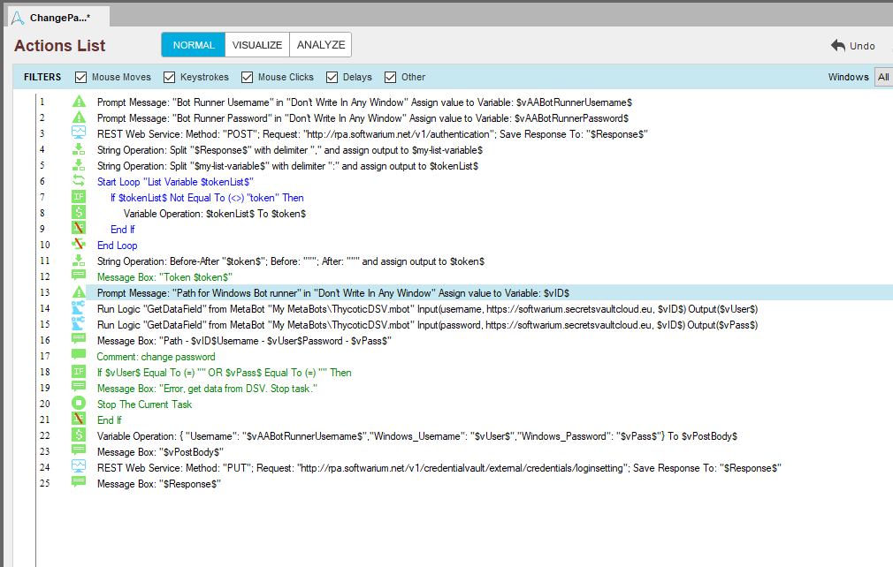

[title]: # (Automation Anywhere, Change password)
[tags]: # (DevOps Secrets Vault,DSV)
[priority]: # (3)

## Change password for service account

The mechanism for launching bots in the Automation Anywhere environment is determined by the parameters specified in the Automation Anywhere Entheprise  Client settings, ``Tools->Options->Login settings->Windows Login Credntials``. See documentation [Setting up Auto Login](https://docs.automationanywhere.com/bundle/enterprise-v11.3/page/enterprise/topics/aae-client/bot-creator/customizing-an-automation-client/setting-up-auto-login.html).

For change password in AA client used REST API build-in Automation Anywhere [Auto Login Credentials API overview](https://docs.automationanywhere.com/bundle/enterprise-v11.3/page/enterprise/topics/control-room/control-room-api/bot-login-api-overview.html).

To accomplish this task, we will use the ``GetDataFied`` method from metabot ``ThycoticDSV``.

For the work of this taskbot there will be an interactive input of the following data:
> ``$AABotRunnerUsername$`` - current username for AA client
> 
> ``$AABotRunnerPassword$`` - current password for AA client
> 
> ``$vID`` - path for DSV with credential, where must by data for fields ``username`` and ``password``

After entering the necessary data, we authorize to the Automation Anywhere server, request a new username and password for the Windows machine (service account), and then replace it.

To automate this process, run this task in the sheduler. Set input variable from command line or envirement variables.