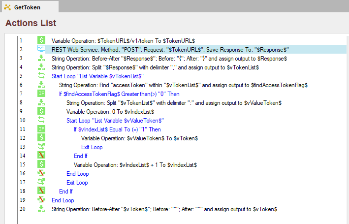
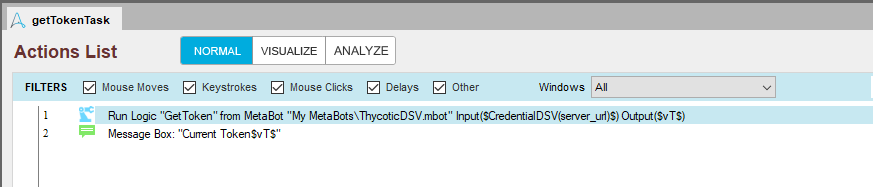
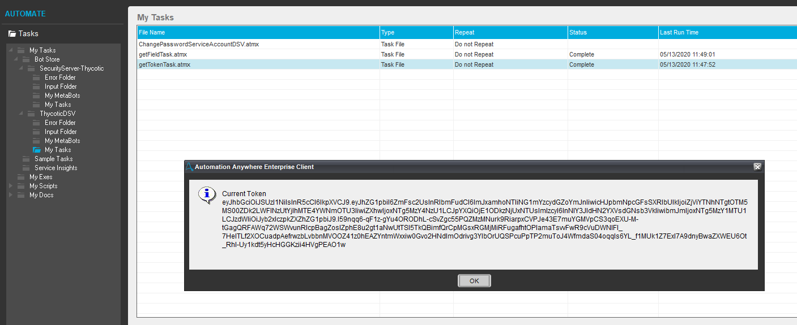
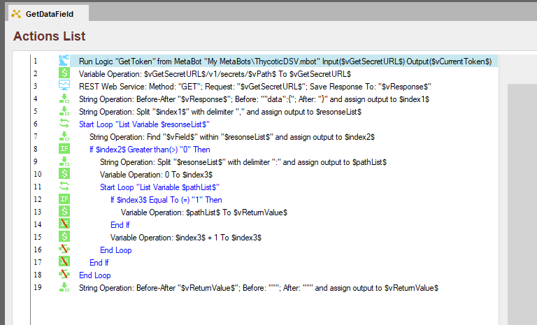
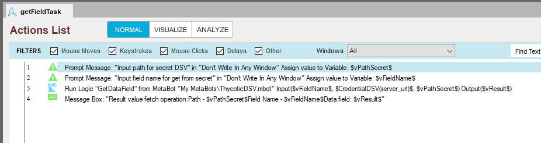
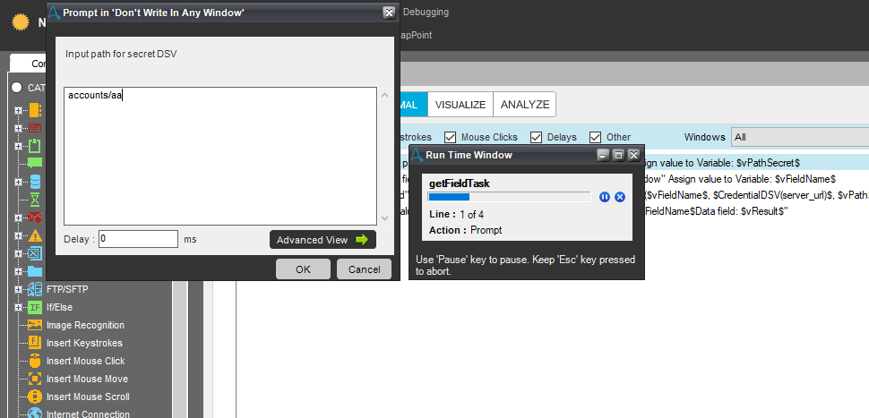
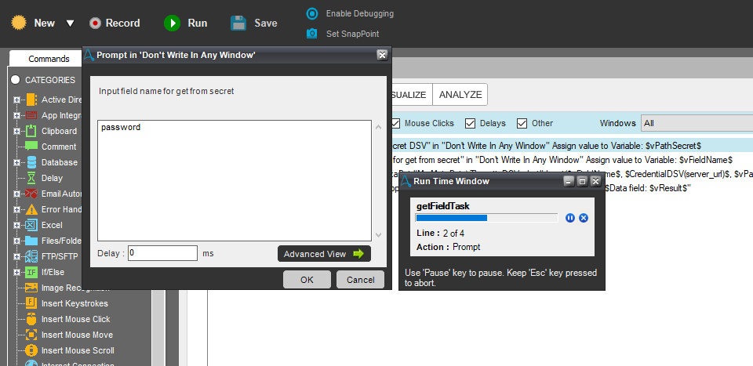
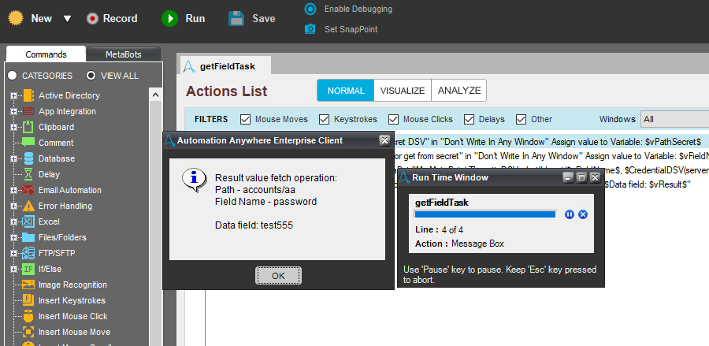

[title]: # (Automation Anywhere, Metabot ThycoticDSV)
[tags]: # (DevOps Secrets Vault,DSV)
[priority]: # (3)

## Description logic metabot ThycoticDSV

The metabot consists of three methods that implement the REST API calls to work with DSV. If necessary, they can be increased to implement all API calls described in the documentation [REST API for DSV](https://dsv.thycotic.com/api).

In the built-in Automation Anywhere procedures, there is no mechanism for working with data presented in the form of JSON, so as not to complicate the logic with stronghold products, we carry out the JSON analysis on our own. However, you can use the [Newtonsoft](https://www.newtonsoft.com/json) library for these purposes.

---

### GetToken
The method implements an REST API [Authorization](https://dsv.thycotic.com/api#operation/token) call to obtain an access token. Authorization is carried out by ``client_id`` and ``client_secret`` with ``grant_type=client_credentials``.

> Input parameters: 
> 
> ``$CredentialDSV(client_id)$`` - string client_id , get value from internal credential store, however you may assign to variable.
>
> ``$CredentialDSV(client_secret)$`` - string client_secret , get value from internal credential store, however you may assign to variable.
> 
> ``$CredentialDSV(server_url)$`` -  string server_url , get value from internal credential store, however you may assign to variable.

> Output parameters: 
>
> ``$vToken$`` - string  Token , set Bearer authorization token.
> 

***Example call method***

Result running task:

---

### GetDataField
The method implements an REST API [Get Secret](https://dsv.thycotic.com/api#operation/getSecret) and parse section ``data`` for search field defined in input parameters (ex. `username`, `passowrd`, `machine` and other).

For authorization session call method ``GetToken`` include in current metabot.

> Input parameters:
> ``$CredentialDSV(server_url)$`` -  string server_url , get value from internal credential store, however you may assign to variable.
> 
> ``$vPath$`` - string value, ***path*** secret.
> 
> ``$vField$`` - string value, name field data in section ``data`` secret, can be any, set when creating a secret.
> 
> Output parameters:
> 
> ``$ReturnValue$`` - string value, secret field value found.

***Example call method***

Result running task:

