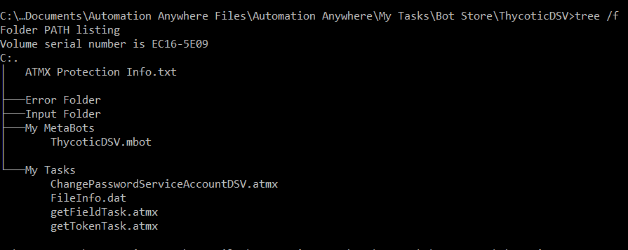
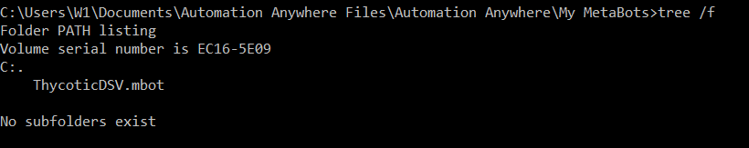
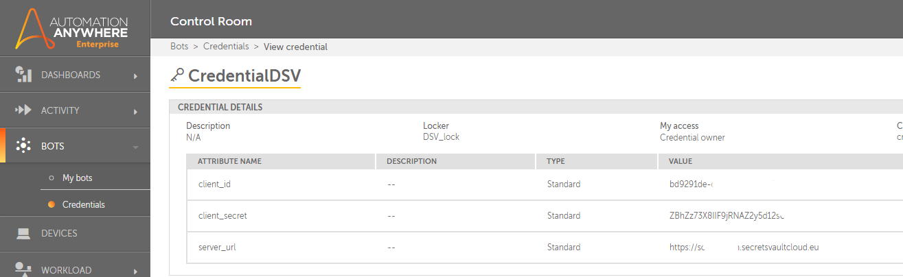
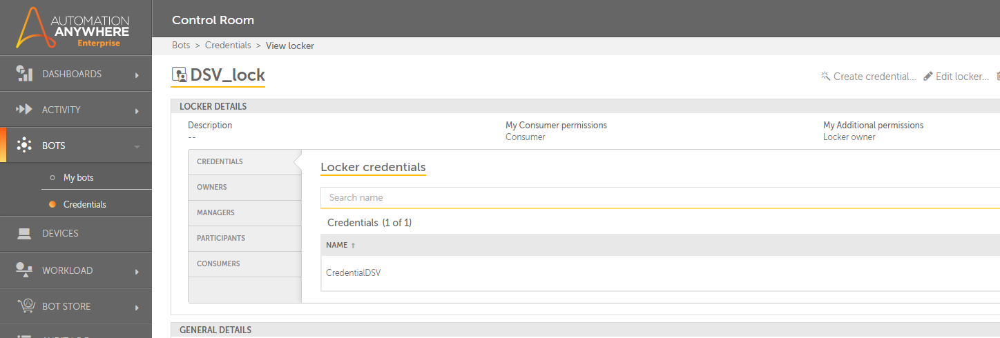

[title]: # (Configure Automation Anywhere)
[tags]: # (DevOps Secrets Vault,DSV)
[priority]: # (2)
# Configure Automation Anywhere

>**Note**: For development and testing usage Automation Anywhere Enterprise Edition version 11.3.

Installed metabot ***ThycoticDSV*** using standard import mechanism.

## Create Secret Fields in Automation Anywhere Credential Vault

For the use of information security using Automation Anywhere, it is proposed to use an internal secret store. It is possible to pass the necessary access parameters to DSV through ordinary variables.

To access DSV, you must set the following variables:

* `client_id` - identifier client
* `client_secret` - secret for client
* `server_url` - url for access DSV server, include tenant, ex. ``tenant - test001`` and choose Thycotic Cloud Manager - ``secretsvaultcloud.eu`` , result ``https://test001.secretsvaultcloud.eu``

Create credential name ***CredentialDSV*** with attribute: client_id, client_secret, server_url

Create credential lock ***DSV_lock*** for credential ***CredentialDSV***

Using the built-in storage of variables is not necessary, you can pass access parameters to DSV through variables to call a metabot.
