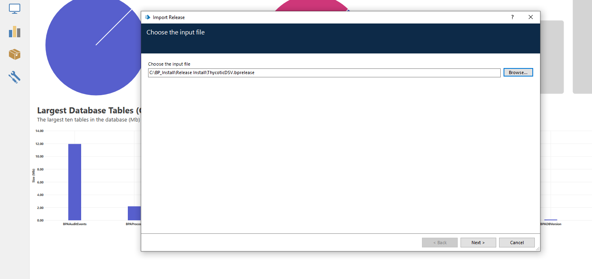
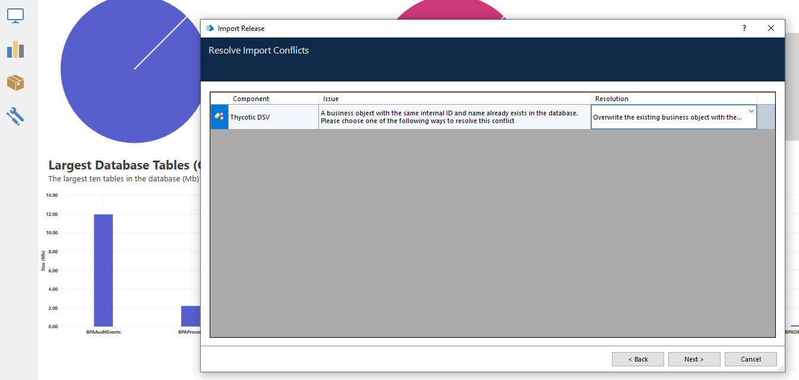
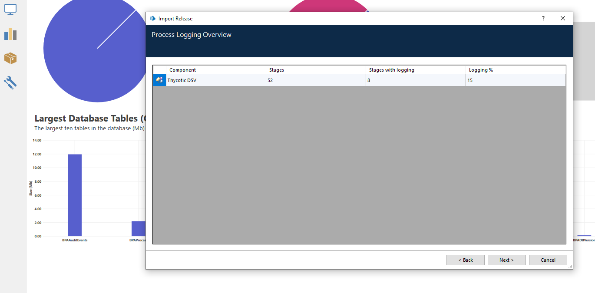
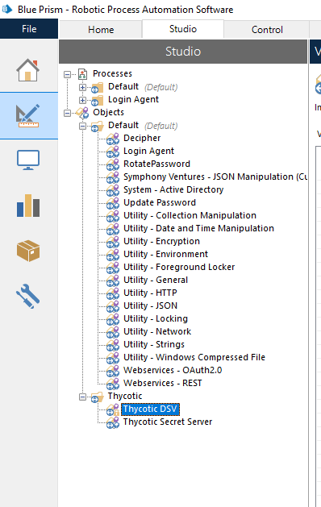
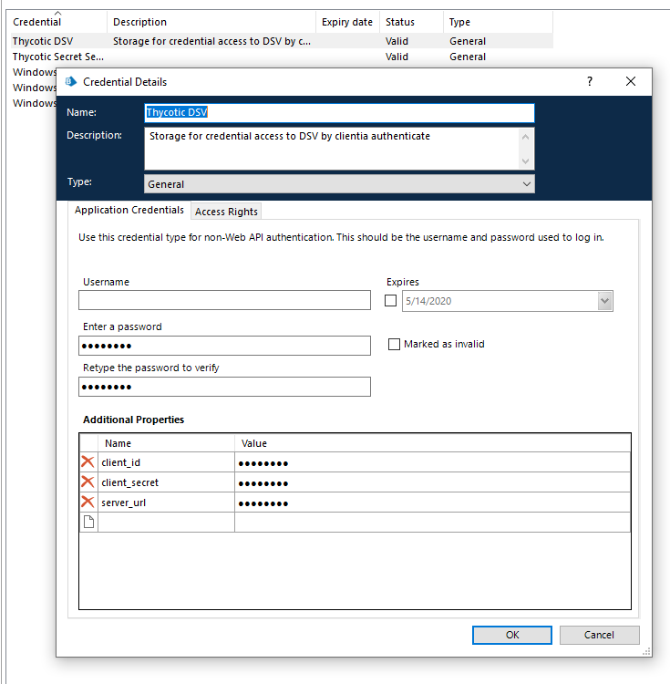

[title]: # (Blue Prism, Configure Blue Prism)
[tags]: # (DevOps Secrets Vault,DSV)
[priority]: # (2)

# Installation and system requirements

The primary version of [Blue Prism](https://www.blueprism.com/) is used version 6.7

To use the Thycotic DevOps Secret Vault package, you must have standard visual business object installed in Blue Prism.

Import the following VBO from the application directory ``C:\Program Files\Blue Prism Limited\Blue Prism Automate\VBO``

> BPA Object - Utility - Collection Manipulation
>
> BPA Object - Utility - Environment
>
> BPA Object - Utility - General
>
> BPA Object - Utility - HTTP
>
> BPA Object - Utility - JSON
>
> BPA Object - Utility - Strings
>
> BPA Object - Webservices - REST

If you plan to use a method that allows you to change the service account on the resource machine, you must install package
[Login Agent](https://usermanual.wiki/Pdf/Blue20Prism20User20Guide2020Login20Agent.779174028/html)
from application directory ``C:\Program Files\Blue Prism Limited\Blue Prism Login Agent``

### Import the installation package **Release ThycoticDSV.bprelease**

1. Select import file

2. Select package

3. Resolve import conflict

4. Finish install

### Configure Credential for DevOps Secret Vault

After successful import of the package, you need to set the account settings to access the Cloud DSV.

Create if there is no credential, in the example we use the name ``Thycotic DSV``

And then enter the required settings

>
> **server_url** - base URL for access DSV, ex. <https://test.secretsvaultcloud.eu>
>
> **client_id** - identificator client
>
> **client_secret** - client secret above create client
>
And in the tab "Access Rights" on switch the required rights.

