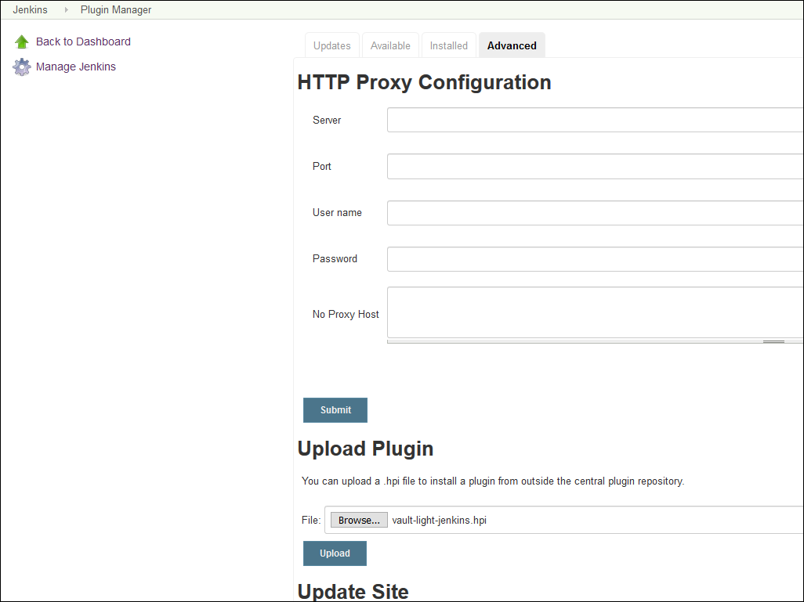
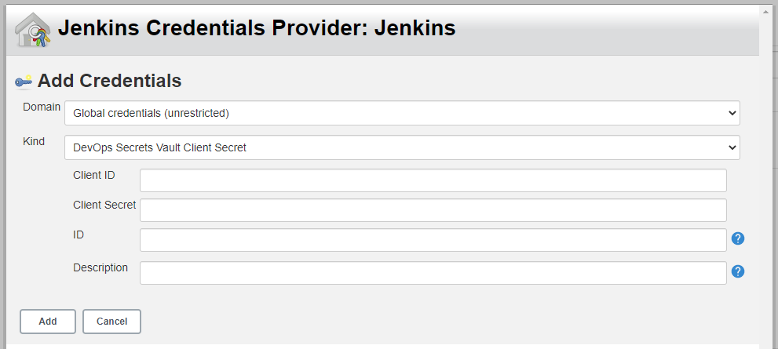
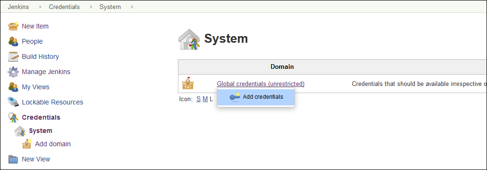
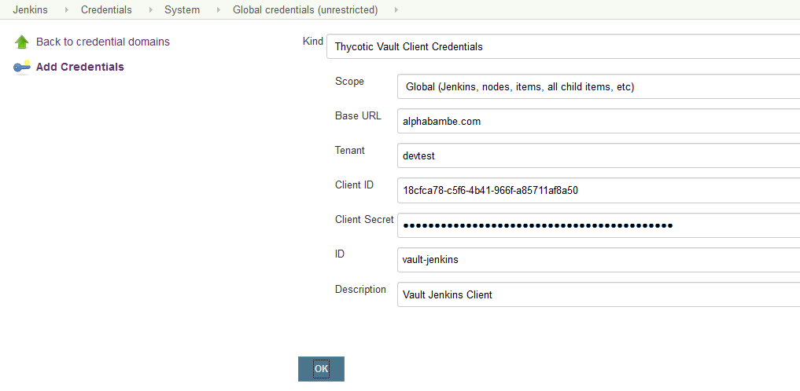
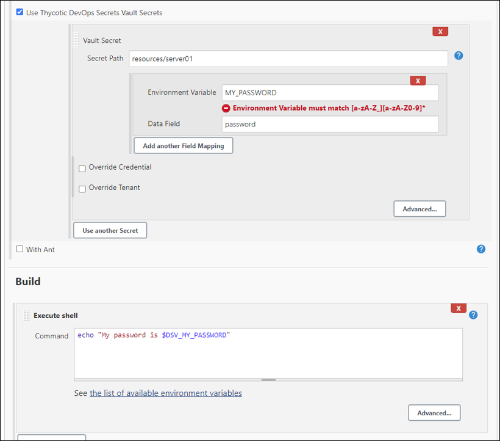
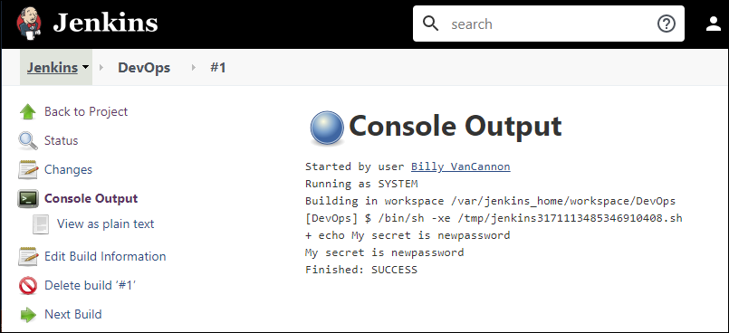

[title]: # (Jenkins)
[tags]: # (DevOps Secrets Vault,DSV,)
[priority]: # (100000)

# Jenkins Extension for DevOps Secrets Vault 

The Jenkins extension allows builds to retrieve Secrets from the vault at runtime. It can bind Secrets to environment variables through a build step.

## DevOps Secrets Vault Setup

Use the DSV CLI to create a new client credential linked to a Role that has read permissions on Secrets Jenkins will need. 

### Create a Role, Client Credentials, and Jenkins Policy.

Create a Role

```BASH
thy role create --name jenkins --desc "grants access to build Secrets"
```

Create a Client Credential

```BASH
thy client create --role jenkins
```

Save the *clientId* and *clientSecret* returned by this command. You will use these to grant Jenkins access to the vault.

Create (or add to) a Permission Policy that will grant the Jenkins Role access to the secret Jenkins requires.  As an example for creating the policy:

```BASH
thy policy create --path secrets:resources:path --actions read --subjects 'roles:jenkins' --desc "Jenkins Access"
```

```BASH
thy policy read --path secrets:resources:path -e yaml
```

Would show:

```yaml
created: "2020-08-28T15:50:17Z"
createdBy: users:thy-one:admin@company.com
id: xxxxxxxx-xxxx-xxxx-xxxx-xxxxxxxxxxxx
lastModified: "2020-08-28T15:50:17Z"
lastModifiedBy: users:thy-one:admin@company.com
path: secrets:resources:path
permissionDocument:
- actions:
  - read
  conditions: {}
  description: Jenkins Access
  effect: allow
  id: xxxxxxxxxxxxxxxxxxxx
  meta: null
  resources:
  - secrets:resources:path:<.*>
  subjects:
  - roles:jenkins
version: "0"
```

### Create a Test Secret

To use Secrets from the vault in the Jenkins build pipelines, we need a Secret for the Jenkins Role to access. Note that in the configuration above, the Jenkins Role has access to read anything under *resources*. 

We will create a test Secret at the path *resources/server01*:

```BASH
thy secret create resources/server01 '{"servername":"server01","password":"somepass1"}'
```

Read back the Secret to verify the data looks right:

```BASH
thy secret read -be JSON resources/server01
```

The resulting JSON Secret should look similar to:

```json
{
  "attributes": null,
  "data": {
    "password": "somepass1",
    "servername": "server01"
  },
  "id": "xxxxxxxx-xxxx-xxxx-xxxx-xxxxxxxxxxxx",
  "path": "resources:server01"
}
```
## Obtain the Jenkins HPI

Download the [latest version of the Jenkins HPI extension](https://github.com/thycotic/dsv-jenkins-plugin).

## Install

In Jenkins, select **Manage Jenkins > Manage Plugins > Advanced**.

In the *Upload Plugin* section, click **Browse**.

Locate the **dsv-jenkins.hpi** you downloaded, select it, then click **Upload**.




## Configure the Plugin

Go to **Manage Jenkins** then **Configure System** and scroll down to the section titled *Thycotic DevOps Secrets Vault*


By *Default Client Secret* click **Add**, then **Jenkins**

By *Kind*, from the dropdown select **DevOps Secrets Vault Client Secret**

Now enter the *Client ID* and *Client Secret* that was created in DSV earlier.

Optionally enter an *ID* and/or *Description*



Click **Add**

You are sent back to the Jenkins -> Configuration page.  By *Default Client Secret* in the drop down select the client you just added.

By *Default Vault Tenant*, enter your DSV tenent  (If your URL is company.secretsvaultcloud.com, then the tenent is *company*)

By The *Environmental Variable Prefix* you will find that *DSV_* is there by default.  This is automatically pre-pended to the name of the environmental varible that you assign later.  This is to help avoid using reserved Jenkins names.   You can make delete or change this as required.

If you are using the European Union or Asia-PAC URL, then click **Advanced**.  Here you will replace *com* with *eu* or *com.au* to accomodate the different URL - ie company.secretsvaultcloud.eu or company.secretsvaultcloud.com.au


## Add Newly Created Client Credential in Jenkins

In Jenkins, use these steps to add the newly created client credential:

* Under **Credentials**, add new credentials.

  

* Enter the vault URL, your tenant name, the clientId, and the clientSecret from the newly created client credential.

  

* You can specify an ID or let Jenkins autogenerate the ID.

During our Jenkins builds, the extension will pull the *password* value of *somepass1* from the *data* property in the Secret.

## Freestyle Build

If you prefer not to modify an existing build, create a new item in Jenkins and select **Freestyle project**.

To get credentials in a Freestyle build:

* Under **Build Environment**, mark the **Thycotic Light Vault Plugin** checkbox active.
* Choose the credential previously created. This will authenticate to the vault to get Secrets.
* Add a Secret and enter:
  * the path to the Secret in the vault
  * the environment variable to which you want to bind the Secret value
  * the Secret data field from which to get the value; in this case we are getting the value from the *password* field of our previously created Secret
* In build steps, you can reference the environment variable as you normally would. For example, the shell script shown here will echo the *$MY_PASSWORD* environment variable.



* The console output of the build should show the retrieved Secret password value of "somepass1" as expected.

  


