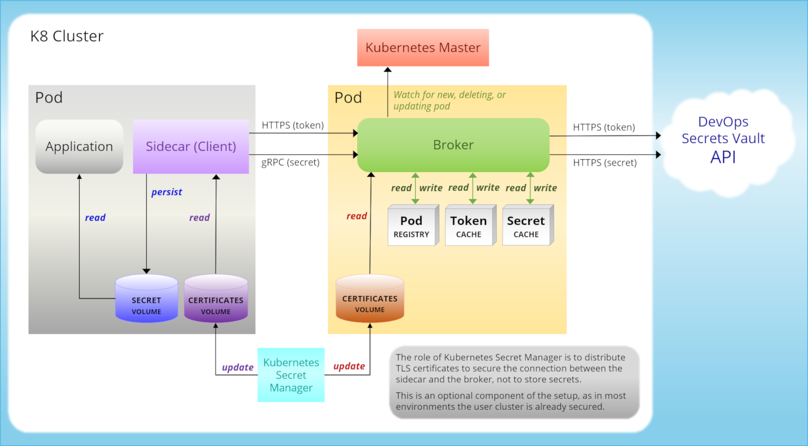

[title]: # (Kubernetes)
[tags]: # (DevOps Secrets Vault,DSV,)
[priority]: # (100100)
# Kubernetes

The Kubernetes extension to DevOps Secrets Vault consists of several images available from Docker. These illustrate how to build containers incorporating DevOps Secrets Vault functionality. To obtain these images, at your Docker command line, use *docker pull* commands for each image:

```BASH
docker pull quay.io/thycotic/devops-secrets-vault-client
docker pull quay.io/thycotic/devops-secrets-vault-broker
docker pull quay.io/thycotic/devops-secrets-vault-example
```

## Overview

Kubernetes helps coordinate containerized applications across a cluster of machines. DevOps Secrets Vault (DSV) will integrate with any existing Kubernetes application deployment. This article, with reference to the example YAML code, explains how you would use the provided client and broker YAML to implement the DSV application with your cluster.

## Architecture

The illustration shows an example of a Kubernetes Architecture implementation.





In studying the diagram, it would be easy to mistakenly conclude that the Kubernetes Secrets Manager is being used to store the pods’ Secrets, which is not the case. The action of Kubernetes Secrets Manager here is to distribute TLS certificates to secure the connection between the DSV broker and sidecar agent, in cases where this is desirable. In most cases this would be unnecessary since the user cluster will typically be secured already.

If Secrets were to be stored in Kubernetes Secrets Manager, they would be universally available in the cluster—contrary to the goal. Instead, with the DSV broker, and with the volume mount sharing depicted in the diagram, each pod sees only its own Secrets, and Secrets remain available as long as the pods are healthy.

# Description of Operations

The example application uses a **broker** and client container deployment with volume mount sharing for pods to access the retrieved Secrets. This page includes an example of a *broker.yml* suitable for creation.

## Introduction to the Broker

The Role definition at the beginning of the *broker.yml* file enables the broker pod to execute. The Service descriptions in the *broker.yml* example below are also required as the DSV client uses the name to make internal calls.

In using the *broker.yml* file, be sure to first swap in variable values appropriate to your organization, specifically:

```yaml
        - name: TENANT
          value: your_tenant_name
        - name: CLIENT_ID
          value: xxxxxxxx-xxxx-xxxx-xxxx-xxxxxxxxxxxx
        - name: CLIENT_SECRET
          value: xxxxxxxxxxxxxxxxxxxxxxxxxxxxxxxxx-xxxxxxxxx
```

When the broker is running, it watches for new pods coming online that execute with a specific Annotation, *dsv*. For each such pod, it looks at the value of the **tenant** to be used, and adds the pod to its internal registry.

### The Broker YAML File

```yaml
kind: ClusterRole
apiVersion: rbac.authorization.k8s.io/v1
metadata:
  namespace: default
  name: dsv-service-pod-reader-binding
rules:
- apiGroups: [""] # "" indicates the core API group
  resources: ["pods"]
  verbs: ["get", "watch", "list"]
---
kind: ClusterRoleBinding
apiVersion: rbac.authorization.k8s.io/v1
metadata:
  name: dsv-service-pod-reader-binding
roleRef:
  apiGroup: rbac.authorization.k8s.io
  kind: ClusterRole
  name: dsv-service-pod-reader-binding
subjects:
  - kind: ServiceAccount
    name: default
    namespace: default
---
apiVersion: v1
kind: Secret
metadata:
  name: thycotic-keys
  namespace: default
type: Opaque

---

apiVersion: apps/v1beta2
kind: Deployment
metadata:
  name: dsv-broker
spec:
  replicas: 1
  selector:
    matchLabels:
      app: dsv-broker
  strategy:
    type: RollingUpdate
    rollingUpdate:
      maxUnavailable: 1
      maxSurge: 1
  template:
    metadata:
      labels:
        app: dsv-broker
    spec:
      containers:
      - name: dsv-broker
        image: 661058921700.dkr.ecr.us-east-1.amazonaws.com/bambe-controller:latest
        imagePullPolicy: IfNotPresent
        volumeMounts:
          - name: secretkey
            mountPath: /tmp/keys
            readOnly: true
        env:
        - name: REFRESH_TIME
          value: 5m
        - name: THY_API_URL
          value: https://%s.devbambe.com/v1
        - name: TENANT
          value: testtenant
        - name: CLIENT_ID
          value: xxxxxxxx-xxxx-xxxx-xxxx-xxxxxxxxxxxx
        - name: CLIENT_SECRET
          value: xxxxxxxxxxxxxxxxxxxxxxxxxxxxxxxxx-xxxxxxxxx
        - name: LOG_LEVEL
          value: debug
      volumes:
        - name: secretkey
          secret:
            secretName: thycotic-keys

---
kind: Service
apiVersion: v1
metadata:
  name: dsv-broker
spec:
  selector:
    app: dsv-broker
  ports:
  - protocol: TCP
    port: 80
    targetPort: 3000
---
kind: Service
apiVersion: v1
metadata:
  name: dsv-auth
spec:
  selector:
    app: dsv-broker
  ports:
  - name: http
    protocol: TCP
    port: 80
    targetPort: 8080
  - name: https
    protocol: TCP
    port: 443
    targetPort: 443
```

This file can also be used locally, for example:

`kubectl create -f broker.yml`

## Introduction to the Client

The client container fetches and periodically updates a configuration file stored at a shared volume. This is defined as a shared volume by the pods within the container (see *example.yml*).

Be sure in your application container to add a volume mount to the shared information, as follows.

```yaml
volumeMounts:
- name: client-volume
    mountPath: /var/secret/
```

For the container running the DSV client, you should define the following as environment variables:

```yaml
env:
- name: REFRESH_TIME
    value: 5s
- name: THY_SECRETS
    value: resources/us-east-1/server1
- name: POD_IP
    valueFrom:
    fieldRef:
        fieldPath: status.podIP
- name: POD_NAME
    valueFrom:
    fieldRef:
        fieldPath: metadata.name
```

*THY_SECRETS* defines the path(s) of the Secrets the container uses. This is a list separated by spaces.

### Example YAML

```yaml
apiVersion: v1
kind: Secret
metadata:
  name: thycotic-keys
  namespace: default
type: Opaque

---

apiVersion: apps/v1beta2
kind: Deployment
metadata:
  name: secret-example
spec:
  replicas: 1
  selector:
    matchLabels:
      app: secret-example
  strategy:
    type: RollingUpdate
    rollingUpdate:
      maxUnavailable: 1
      maxSurge: 1
  template:
    metadata:
      labels:
        app: secret-example
      annotations:
        dsv: testtenant
    spec:
      containers:
      - name: bambe-example
        image: 661058921700.dkr.ecr.us-east-1.amazonaws.com/bambe-example:latest
        imagePullPolicy: IfNotPresent
        volumeMounts:
        - name: client-volume
          mountPath: /var/secret/

      - name: bambe-client
        image: 661058921700.dkr.ecr.us-east-1.amazonaws.com/bambe-client:latest
        imagePullPolicy: IfNotPresent
        env:
        - name: REFRESH_TIME
          value: 5s
        - name: THY_SECRETS
          value: resources/us-east-1/server1
        - name: LOG_LEVEL
          value: error
        - name: POD_IP
          valueFrom:
            fieldRef:
              fieldPath: status.podIP
        - name: POD_NAME
          valueFrom:
            fieldRef:
              fieldPath: metadata.name
        volumeMounts:
        - name: client-volume
          mountPath: /var/secret/
          readOnly: false
        - name: secretkey
          mountPath: /tmp/keys
          readOnly: true
      volumes:
      - name: client-volume
        emptyDir: {}
      - name: secretkey
        secret:
          secretName: thycotic-keys
```


