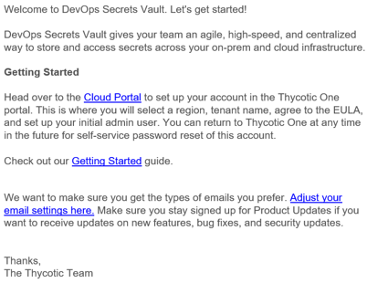
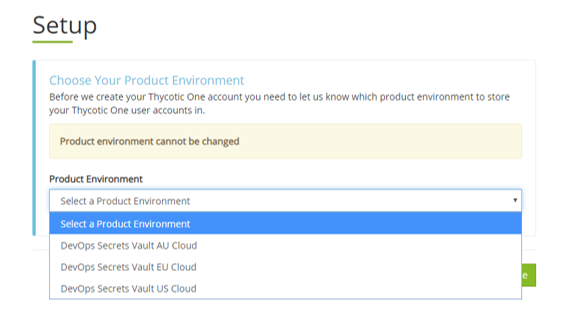

[title]: # (Obtain DevOps Secrets Vault)
[tags]: # (DevOps Secrets Vault,DSV,)
[priority]: # (2100)

# Sign Up with Thycotic for a Tenant

Your **tenant** is your DevOps Secrets Vault cloud account and the rights to access it.

* To sign up, visit Thycotic's [DevOps Secrets Vault Home Page](https://thycotic.com/products/devops-secrets-vault-password-management/) and fill out and submit the **DevOps Secrets Vault Free** web form.
* Signing up qualifies you for a free, feature-complete try-out version of DevOps Secrets Vault. You begin with the free version to get configured, and upgrade when you need more capacity than the free version's 250 Secrets and 2500 API calls per month.
* An initial email from Thycotic Customer Support will arrive with the subject, "Welcome to the Thycotic Community!". There is a link to sign up for a Thycotic support account.  You can wait until you need support to sign up.  Also, if you already have a support account because of a previous Thycotic cloud subscription, then this can be ignored.
* A second email, also from Thycotic Sales, but with the subject, "DevOps Secrets Vault" will arrive.  
* Click the hyperlink labeled "Cloud Portal" in the text of the email to click to get started.

* You will visit Thycotic Cloud Manager to select your region.  The three regions are independent for data sovereignty reasons (like GDPR).  All three provide geographical redundancy.

| Option   | Primary Region       | (Active standby)  | Base URL                |
| -------- | ---------------------| ------------------|---------------          |
|AU        | Sydney               | Singapore         | secretsvaultcloud.com.au    |
|EU        | Frankfurt            | Ireland           | secretsvaultcloud.eu    |
|US        | US-East              | US-West           | secretsvaultcloud.com   |

* Next you are taken to Thycotic One to set a password.  

* NOTE: The person setting up the DevOps Secrets Vault tenant will be considered the *initial administrator* and Thycotic One will be established as that person's authentication provider.  This is to enable Thycotic to help in case the password is lost.  

    * It is up to the customer to set any future users as local or through Thycotic One, AWS, or Azure.
    * Thycotic One can be setup later to enable SSO to an identity provider of the customer's choice using OIDC.
    * Thycotic One can be setup later to enable 2FA when used as the identity provider. The options are TOTP (such as Google Authenticator) and SMS. 

* Choose your tenant name.

* Read and agree to the EULA and GDPR (if applicable)

* The tenant will be created.  The note on the screen says it can take up to 20 minutes, but is usually closer to 5 minutes.

The next step is downloading the [CLI executable](../obtaincli/index.md).

