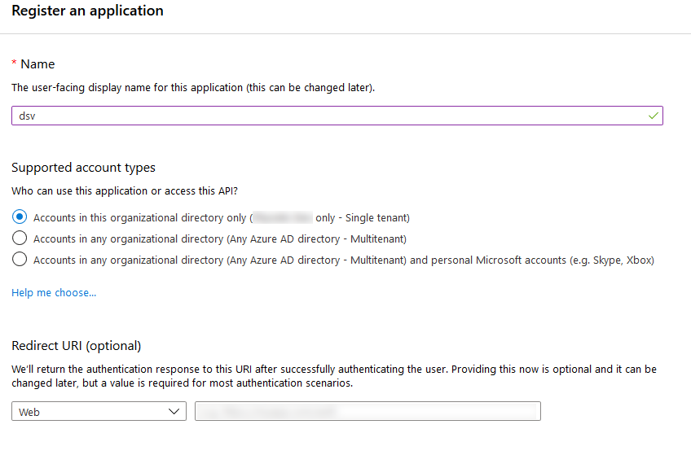
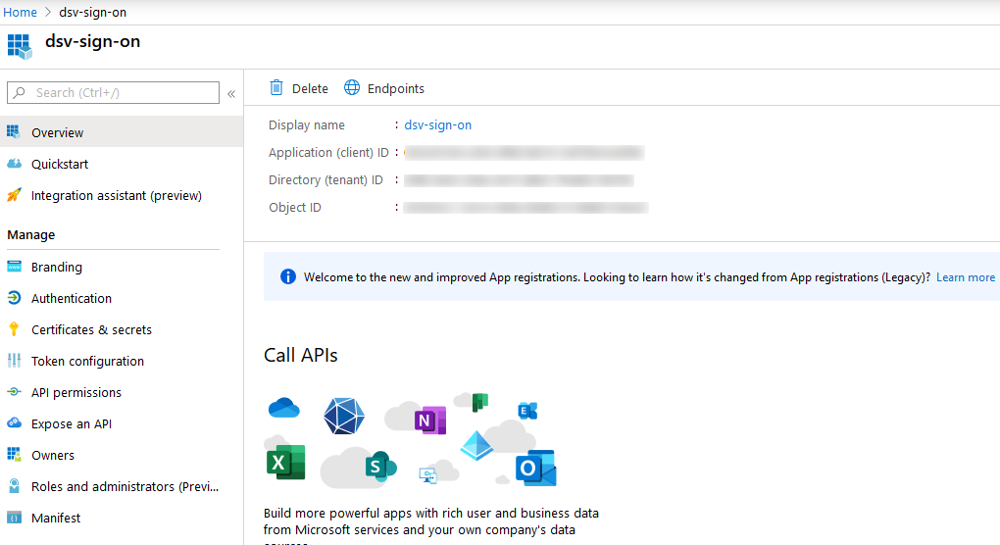

[title]: # (Azure AD Example)
[tags]: # (DevOps Secrets Vault,DSV,)
[priority]: # (5720)

# Azure AD OIDC Example

1. Get the callback URL from Thycotic One following the directions at [Authentication:OIDC](./index.md)
2. In your azure portal go to **Azure Active Directory** and then go to the App Registrations.
3. Click **New Registration**
4. Give your app a name and add the Callback URL from Thycotic One as the Redirect URI.

5. Click **Register** to save your app.
6. Go to your app's **Certificates and Secrets**  and click **New Client Secret**
7. Set the time period for the secret and click **Add**. 
8. Copy the client secret, note that it will not be available after you leave the page.
9. Go to **Authentication** and check the box for **ID Tokens** in the implicit grant section and save.
10. Navigate to **Overview** and note the Application ID and Directory ID. The Application ID is your Client ID for Thycotic One and the Directory ID will be part of your provider URL in the format https://login.microsoftonline.com/{directory id}

11. Go back to the open dialog in Thycotic One and enter the Application ID for the Client ID, the generated secret for Client Secret, and fill in the Provider URL and click **Save**
12. When you sign into thycotic one again you should now see an option for logging in with Azure AD. 

