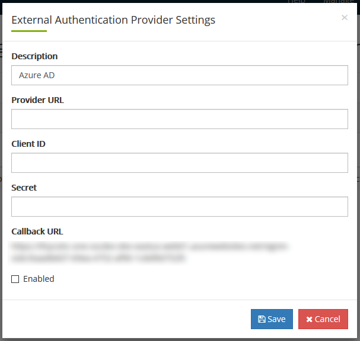

[title]: # (Authentication: OIDC)
[tags]: # (DevOps Secrets Vault,DSV,)
[priority]: # (5700)

# Authentication: OIDC


Use `dsv config auth-provider search --encoding yaml` to see your current authentication settings.

The initial auth settings after your tenant is provisioned should look like this:

```yaml
data:
- created: "2020-04-27T18:04:52Z"
  createdBy: ""
  id: bqjhth447csc72i4sm8g
  lastModified: "2020-04-27T18:04:52Z"
  lastModifiedBy: ""
  name: thy-one
  properties:
    baseUri: https://login.thycotic.com/
    clientId: xxxxxxxxxxxxxxxxxxxxxxxxxxxxxxxxxxxx
    clientSecret: xxxxxxxxxxxxxxxxxxxxxxxxxxxxxxxxxxxxxxxxxxxxxxxxxxxxxxxxxxxxxxxx
  type: thycoticone
  version: "0"
length: 1
limit: 25
```

# OIDC Providers

Any OIDC compliant authentication provider should be configurable to work with Thycotic One and DevOps Secrets Vault. Documented integrations are below.

## Common Steps

For all OIDC authentication providers you will need to get their provider URL, client id, and client secret. You will need to set in the authentication provider the callback URL that it will redirect to once authentication is complete.  

To get your callback URL:

1. Sign into the [cloud manager portal](https://portal.thycotic.com) and go to Manage->Teams and click on Organizations for your team.
2. Click on **Auth Providers** and then click the **New** button. This will open a dialog up. 
3. Give it a name and copy the Callback URL provided. Do not save or cancel, you will be coming back to fill out the rest of the fields.





## Creating a User in Thycotic One and DSV

In order to login using OIDC, the user must exist in the external provider, Thycotic One, and in DSV. 

If your current user, such as your initial admin already exists in all places, then skip this section. If you want to add another user to Thycotic One and DSV simultaneously, do the following steps:

1. In the DSV CLI run `dsv user create --username useremail@company.com --provider thy-one`

2. This creates a user record in DSV and syncs it to Thycotic One. The User will get an email with a link to establish their password.  

3. In the [cloud manager portal](https://portal.thycotic.com), you can see your users by logging in and clicking on the **Users** link.


## Logging In

Initialize the CLI:

```BASH
dsv init
```

Add a new profile if you want to retain your default `dsv` profile.

When prompted for the authorization type, choose *OIDC (federated)*.

```BASH
Please enter auth type:
       (1) Password (local user)(default)
       (2) Client Credential
       (3) Thycotic One (federated)
       (4) AWS IAM (federated)
       (5) Azure (federated)
       (6) GCP (federated)
       (7) OIDC (federated)
```

When prompted for the authentication provider hit Enter to accept the default of `thy-one`

If you are on Windows or Mac OS the CLI should automatically open a browser to the Google login page, otherwise it will print out a URL that you can copy and paste into a browser to complete the process.

Login using your Google credentials and your browser will redirect to `http://localhost:8072/callback`, the CLI is listening on that port and will submit the returned authorization code to DSV to finish the login process.

Verify the login by running (omit the --profile flag if you overwrote your config): 

```BASH
dsv auth --profile profilename
```


