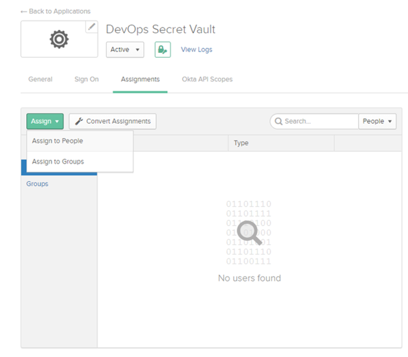

[title]: # (Okta Example)
[tags]: # (DevOps Secrets Vault,DSV,)
[priority]: # (5720)

#Okta Identity Provider Example

This example uses Okta as a OIDC identity provider.

##Okta OIDC connection

1. Get the callback URL from Thycotic's cloud manager portal following the directions at [Authentication:OIDC](./index.md)
2. Login to your Okta Admin console. 
3. From the top menu bar, select **Applications**
4. Select **Add Apliction**
5. At the top right, select **Create New App**.  A window will open
6. For platform, select **Web** from the dropdown and the **OpenID Connect** radio button.  Click **Create**

7. On the resulting screen, provide an **Application name** and optional logo.  Enter the Thycotic callback URL in the box labeled **Login redirect URIs**.  Click **Save**.

8. To the right of General Settings click **Edit**.  Check the **Implicit (Hybrid)** box and it will expand.  Then check **Allow ID Token with Implicit grant type**.
9. In the **Initiate login URI** Okta defaults to copying the Login Redirect URI, so highlight that box and copy "https://portal.thycotic.com" (without quotes) in.  Click **Save**
10. Copy the Client ID and Client secret for entry into the Thycotic Cloud portal

##Add Okta Users and Groups to the DSV Application

11. In second menu bar from the top, click **Assignments**
12. Click **Assign** and when it drops down add users and/or groups that will use DevOps Secrets Vault.

