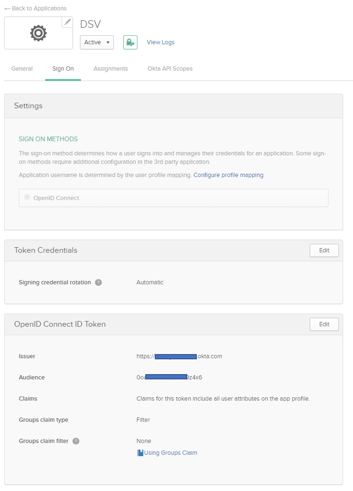
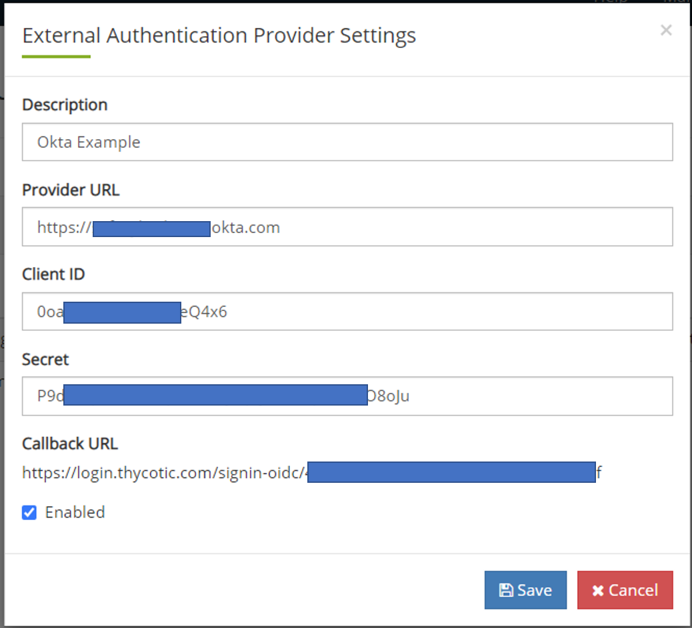
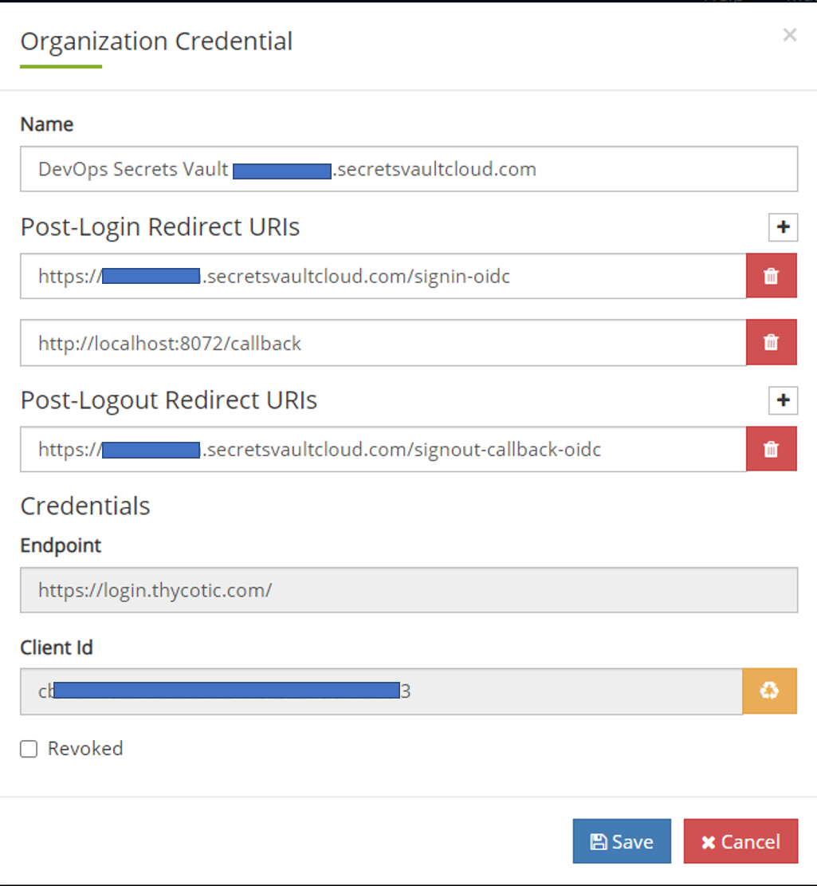

[title]: # (Okta Example)
[tags]: # (DevOps Secrets Vault,DSV,)
[priority]: # (5720)

#Okta Identity Provider Example

This example uses Okta as a OIDC identity provider.

##Okta OIDC connection

1. Get the callback URL from Thycotic's cloud manager portal following the directions at [Authentication:OIDC](./index.md)
2. Login to your Okta Admin console. 
3. From the top menu bar, select **Applications**
4. Select **Add Apliction**
5. At the top right, select **Create New App**.  A window will open
6. For platform, select **Web** from the dropdown and the **OpenID Connect** radio button.  Click **Create**

7. On the resulting screen, provide an **Application name** and optional logo.  Enter the Thycotic callback URL in the box labeled **Login redirect URIs**.  Click **Save**.

8. To the right of General Settings click **Edit**.  Check the **Implicit (Hybrid)** box and it will expand.  Then check **Allow ID Token with Implicit grant type**.
9. In the **Initiate login URI** Okta defaults to copying the Login Redirect URI, so highlight that box and copy `https://portal.thycotic.com` in.  Click **Save**
10. Copy the Client ID and Client secret for entry into the Thycotic Cloud portal

##Retrive the Issuer URL

11. In the second menu bar from the top, click **Sign On**  and in the third box down, titled "OpenID Connect ID Token", take note of the URL by **Issuer** for entry into the Thycotic Cloud portal.  It will generally be something like `https://company.okta.com` or `https://company.oktapreview.com`

##Add Okta Users and Groups to the DSV Application

12. In second menu bar from the top, click **Assignments**
13. Click **Assign** and when it drops down add users and/or groups that will use DevOps Secrets Vault. Of course, you can always come back and add/remove people as needed.

## Finish the Connection on the Thycotic One side

14. Go back to the Thycotic Cloud Manger Portal where we started.  Fill-in a Description and the issuer/provider URL from step 11.
15. Fill-in the Client ID and Client Secret from step 10.
16. Check the **Enable** box.
17. Click **Save**

18. Click **Back to Organizations**
19. Click **Credentials**
20. Click **Edit** and a window will pop-up
21. To the right of "Post-Login Redirect URIs" click the **+** and a new empty box will appear.  In this new box, type `http://localhost:8072/callback`.
>Note: If you have already added this call back for another auth provider, then it should still be there so you can skip these last steps (18-21).

