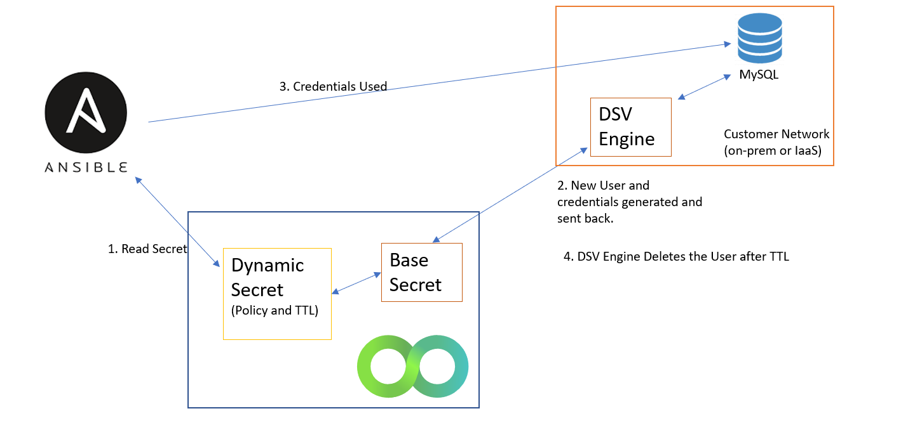

[title]: # (Database Dynamic Secrets)
[tags]: # (DevOps Secrets Vault,DSV,)
[priority]: # (6400)

# Database Dynamic Secrets

Database Dynamic Secrets are similar to IaaS Dynamic Secrets in that the idea is to provide temporary credentials for very specific uses. The possible damage done by leaked credentials is severely limited to due to granular policies and short time-to-live. However, IaaS platforms provide mechanisms for ephemeral credentials with fine-grained policies, and most databases do not. Therefore, DSV provides a way to provide temporary credentials by creating and deleting users in a just-in-time manner.

## DSV Engine Required
Database Dynamic Secrets require the deployment of the DSV Engine.  See the instructions at [DSV Engine](../engine/index.md).
