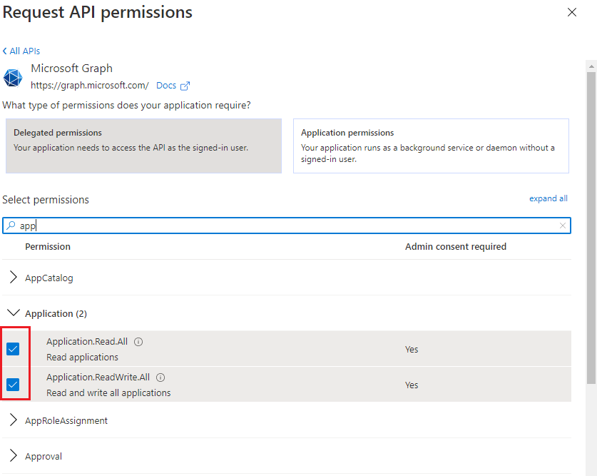
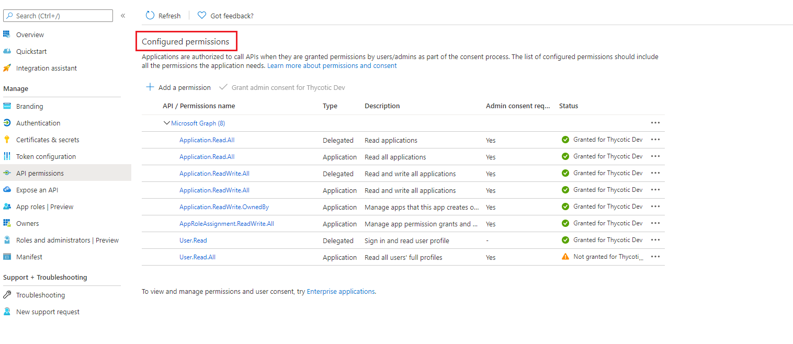

[title]: # (Azure Service Principal)
[tags]: # (DevOps Secrets Vault,DSV,)
[priority]: # (6220)

# Azure Service Principal

This is a step-by-step guide to creating an Azure service principal with the privileges necessary to enable Azure Microsoft Graph credential generation.

An Azure service principal is an identity created for use with applications, hosted services, and automated tools to access Azure resources. 

## Creating a Service Principal for the DSV Base Secret

1. Go to the [Microsoft Azure portal](https://portal.azure.com) and login.
2. Go to **Azure Active Directory**.
3. Click **App registrations** then **New registration**.  Enter an application name and then click **Register**.
4. Take note of the **Application (client) ID** and **Directory (tenant) ID**.  They are the DSV Base secret `clientId` and `tenantId` parameters respectively.

    
    
    

5. Select **Certifications & secrets** then **New client secret**.  Enter a description and when it should expire.  Click **Add**.
6. Take note of the newly generated secret which will be the `clientSecret` parameter in the DSV Base Secret.

    
    
    

7. Select **API permissions** and then **Add a permission**.
9. Under Microsoft Graph,  APIs Select **Delegated permissions**, expand the **Application** accordion, and then check the **Application.Read.All**  **Application.ReadWrite.All** boxes.
   
     
    
    
    

10. Under Microsoft Graph APIs, Select **Application Permissions**, expand the **Application** accordion, and then check the 
**Application.Read.All**  **Application.ReadWrite.All** **Application.ReadWrite.OwnedBy** boxes.

    
    
    
    
10. Under Microsoft Graph APIs, Select **Application Permissions**, expand the **AppRoleAssignment** accordion, and then check the 
**AppRoleAssignment.ReadWrite.All** boxes.

    
    
    

11. Select **Add permisssions** at the bottom of the page.  This takes you back to the API Permissions page.  Notice that the Application permissions have warnings that those permissions are not yet granted.     
12. Click **Grant admin consent ** and then **Yes** (this need administrative privilege).  This step can be easy to miss.

    
    
    
    
13. The final api permission should look like

    
    
    

14. Navigate to **Home > Subscriptions** and take note of the **Subscription ID** that you will be using.  This is the `subscriptionId` in the DSV Base Secret.

    
    
    

## Add appRole in root application or any application  

In the [Azure Dynamic Secrets](azure.md) section, we discuss DSV using an "existing service principal" vs DSV creating a "temporary service principal".  This is guidance on creating an existing service principal in the Azure portal.  In the case of the temporary service principal, no guidance in Azure is needed because DSV creates them.

1. Go to the [Microsoft Azure portal](https://portal.azure.com) and login.
2. Go to **Azure Active Directory**.
3. Click **App registrations** and select application to add new appRole or to pick existing appRole. 
6. Take note of the **ID **.  That is  the DSV Dynamic Secret `appRoleId` parameters.

    
    
    

4. Navigate to **Active Directory  > Enterprise applications**.
5. Select **Your application name** that you configure a appRole in the above steps. 
6. Take note of the **Object ID **.  This is  the DSV Dynamic Secret `resourceId` parameters.

    
    
    
