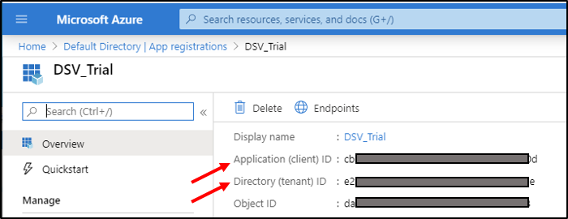
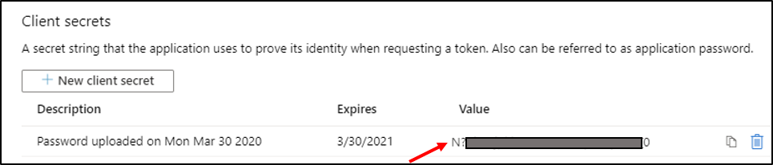
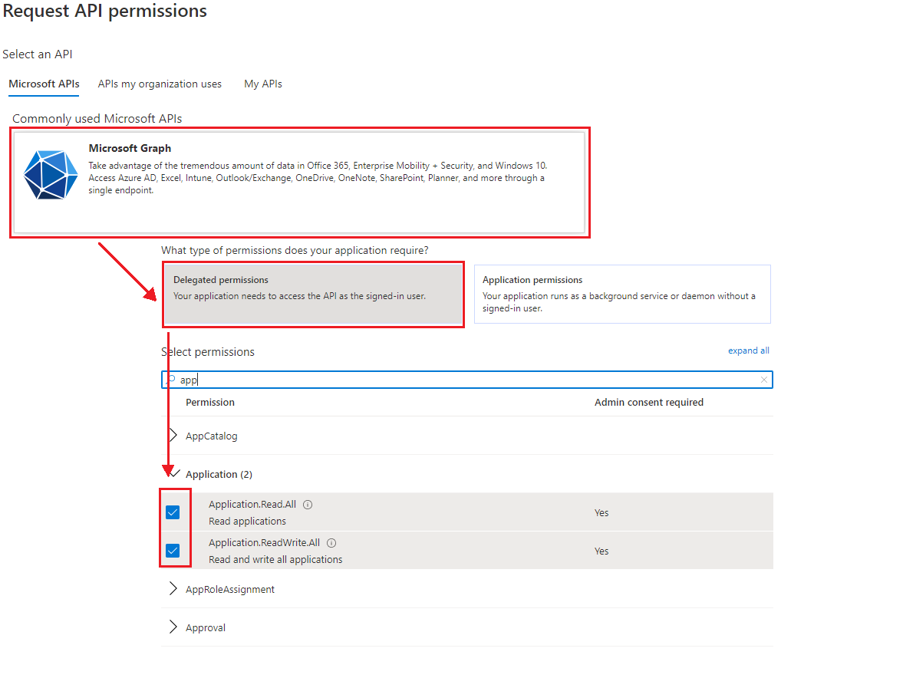
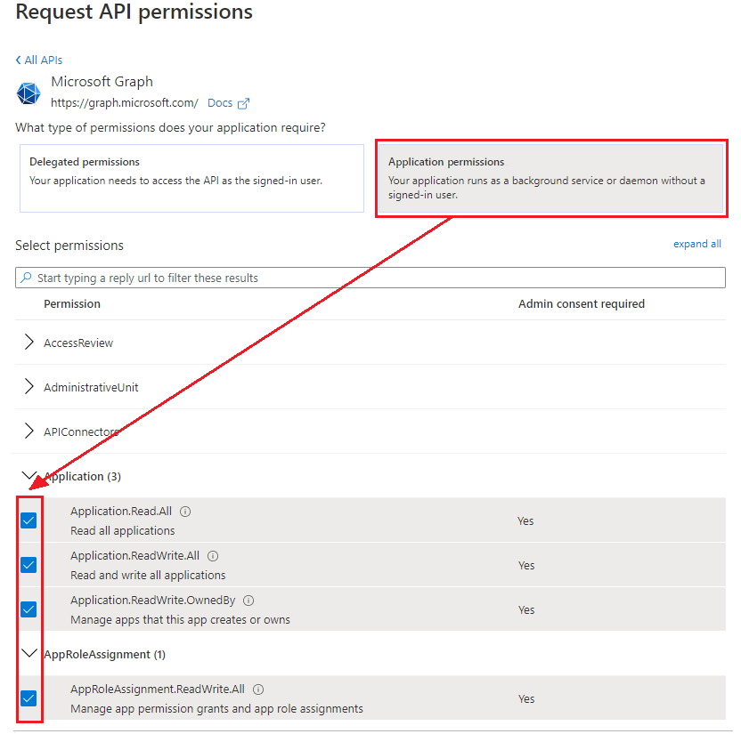
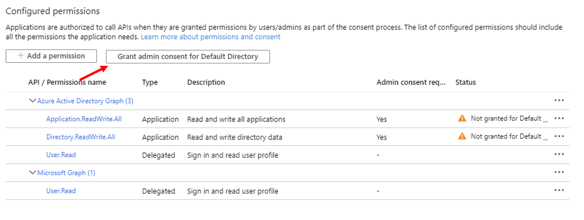
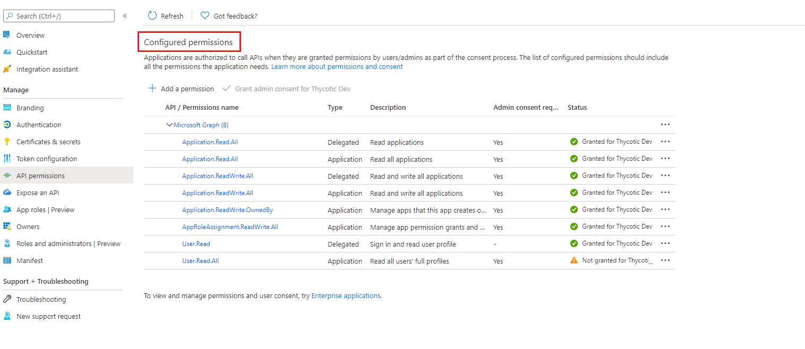
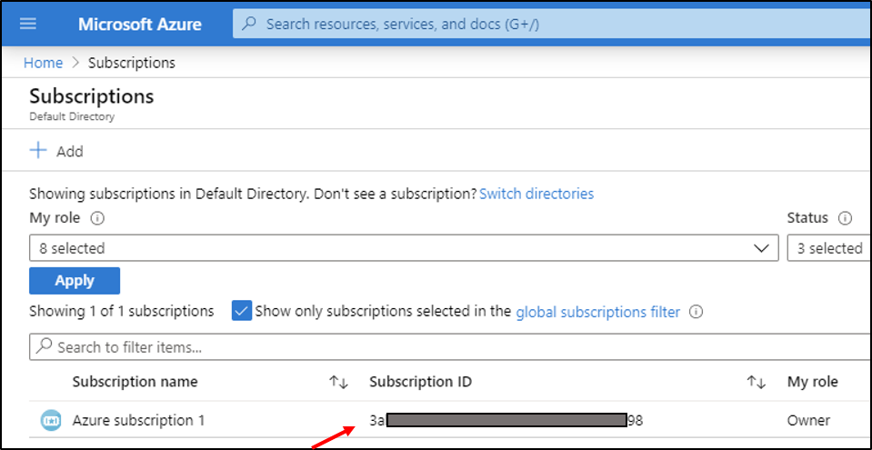
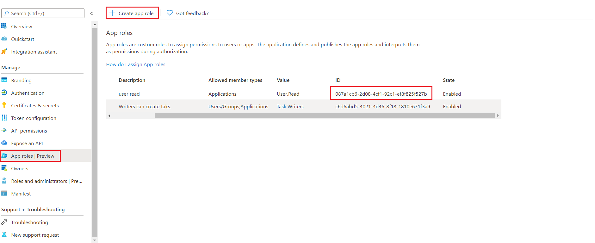
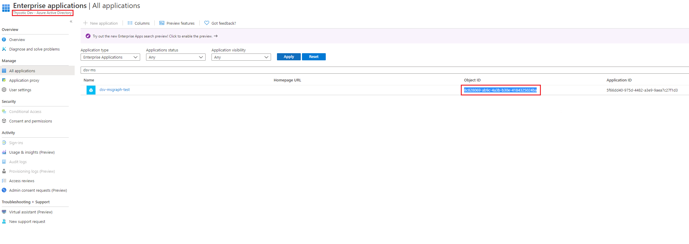

[title]: # (Microsoft Graph Service Principal)
[tags]: # (DevOps Secrets Vault,DSV,)
[priority]: # (6231)

# Azure Service Principal

This is a step-by-step guide to creating an Azure service principal with the privileges necessary to enable Azure Microsoft Graph credential generation.

An Azure **service principal** is an identity created for use with applications, hosted services, and automated tools to access Azure resources. 

## Creating a Service Principal for the DSV Base Secret

1. Login to the [Microsoft Azure portal](https://portal.azure.com).
1. Go to **Azure Active Directory**.
1. Click **App registrations**, then **New registration**.  Enter an application name and then click **Register**.
1. Take note of the **Application (client) ID** and **Directory (tenant) ID**.  They are the DSV Base secret `clientId` and `tenantId` parameters, respectively.

    

1. Select **Certifications & secrets** then **New client secret**. Enter a description and expiration date.  Click **Add**.
1. Take note of the newly generated secret which will be the `clientSecret` parameter in the DSV Base Secret.

    

1. Select **API permissions** and then **Add a permission**.
1. Under Microsoft Graph APIs, first select **Delegated** permissions on the left. Expand the **Application** drop-down and check the **Application.Read.All** and **Application.ReadWrite.All** boxes.

     

1. Now, select **Application** permissions on the right. Expand both the **Application** and **AppRoleAssignment** drop-down, and then check the **Application.Read.All**, **Application.ReadWrite.All**, and **Application.ReadWrite.OwnedBy** boxes under Application and the **AppRoleAssignment.ReadWrite.All** box under AppRoleAssignment.

    

1. Select **Add permissions** at the bottom of the page. This takes you back to the API Permissions page. Notice that the Application permissions have warnings that those permissions are not yet granted.
1. Click **Grant admin consent** and then **Yes** (You will need administrative privileges to complete this step).

    
    
1. The completed api permissions should look like this:

    

1. Navigate to **Home > Subscriptions** and take note of the **Subscription ID** that you will be using.  This is the `subscriptionId` in the DSV Base Secret.

    

## Add appRole in root application or any application  

In the [Azure Dynamic Secrets](../azure/index.md) section, we discuss DSV using an "existing service principal" vs DSV creating a "temporary service principal".  This is guidance on creating an existing service principal in the Azure portal.  In the case of the temporary service principal, no guidance in Azure is needed because DSV creates them.

1. Go to the [Microsoft Azure portal](https://portal.azure.com) and login.
2. Go to **Azure Active Directory**.
3. Click **App registrations** and select application to add a new appRole or to pick an existing appRole. 
6. Take note of the **ID**. That is the DSV Dynamic Secret `appRoleId` parameter.

    

4. Navigate to **Active Directory  > Enterprise applications**.
5. Select the **application name** that you configured in the above steps. 
6. Take note of the **Object ID**. This is the DSV Dynamic Secret `resourceId` parameter.

    
