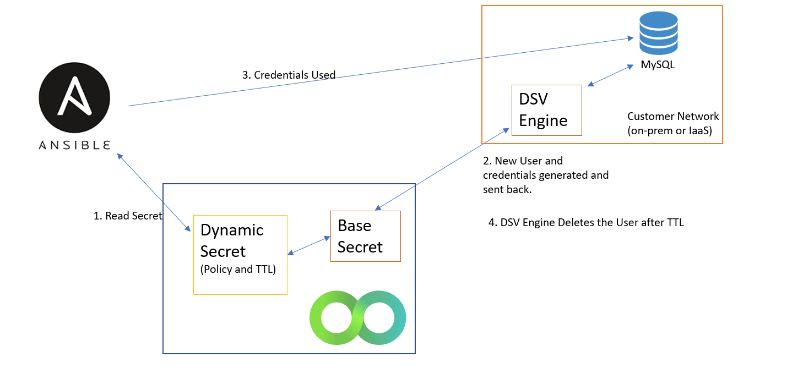

[title]: # (MySQL Dynamic Secrets)
[tags]: # (DevOps Secrets Vault,DSV,)
[priority]: # (6400)


# MySQL Dynamic Secrets 
Database Dynamic Secrets are similar to IaaS Dynamic Secrets in that the idea is to provide temporary credentials for very specific uses.  The possible damage done by leaked credentials is severly limited to due to granular policies and short time-to-live.  However, IaaS platforms provide mechanisms for ephemeral credentials with fine-grained policies, and most databases do not.  Therefore, DSV provides a way to provide ephemeral credentails by creating and deleteing users in a just-in-time manner.



## DSV Engine Required
MySQL Dynamic

## Dynamic Secret Setup

First, create a base secret containing the credentials of the MySQL account that will be responsible for creating new
MySQL accounts on a given MySQL server.

The secret could look like the following:
```
{
    "path": "db:mysql:root",
    "attributes": {
        "type": "mysql"
    },
    "description": "mysql root credentials",
    "data": {
        "host": "database-1.cjqpjhgsaz53.us-east-1.rds.amazonaws.com",
        "password": "P@ssword!",
        "port": 3306,
        "username": "admin"
    }
}
```

The path is arbitrary, as is the description, of all secrets. To mark a secret as a MySQL root secret, ensure
its attributes contain a key `type` with a value of `mysql`. All fields in the `data` object are required.

Second, create a new dynamic secret linked to the root secret. The secret could look like the following:
```
{
    "path": "db:mysql:dyn1",
    "attributes": {
        "grantPermissions": {
            "what": "SELECT",
            "where": "*.*"
        },
        "linkConfig": {
            "linkType": "dynamic",
            "linkedSecret": "db:mysql:root"
        },
        "pool": "pool1",
        "ttl": 1000
    },
    "data": {},
}
```

The path is arbitrary. There is no secret data. All the necessary information is in the attributes, where all the fields are required.
In the `linkConfig`, be sure to specify the path of the root secret as the value of the `linkedSecret` key. The value of 
`linkType` is always `dynamic` for dynamic secrets.

The `grantPermissions` object specifies the permissions assigned by MySQL to the new user account. The `ttl` specifies the number
of seconds for which the new account will exist before the engine automatically deletes it.

The attributes may also include an optional `userPrefix` key whose value is a string prepended to all MySQL account usernames
created from the dynamic secret.


## Sending a MySQL task to an engine

Read the MySQL dynamic secret. A randomly chosen engine in a pool of engines should receive the task and perform it.
The engine attempts to create a MySQL account and reports back success or failure. On success, the user also receives
the new working credentials. As long as there is at least one running engine in a given pool, some engine will receive a
MySQL account revocation task and delete the account once its TTL expires.