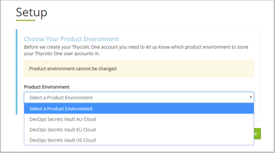

[title]: # (Obtain DevOps Secrets Vault)
[tags]: # (DevOps Secrets Vault,DSV,)
[priority]: # (2100)

# Sign Up with Thycotic for a Tenant

## Video Guide

<iframe src="https://player.vimeo.com/video/490936975/" style="position:absolute;top:0;left:0;width:100%;height:100%;" frameborder="0" title="{video_title}" webkitallowfullscreen mozallowfullscreen allowfullscreen></iframe>

## Tenant Setup Guide
Your **tenant** is your DevOps Secrets Vault cloud account and the rights to access it.
To get your **tenant**:

1. Visit Thycotic's [DevOps Secrets Vault Home Page](https://thycotic.com/products/devops-secrets-vault-password-management/).
1. Fill out  the **DevOps Secrets Vault Free** web form and submit.
    * Signing up qualifies you for a free, feature-complete trial version of DevOps Secrets Vault. The trial version is limited to **250 Secrets** and **2500 API calls** per month. Start by configuring the free version and upgrade when you need more capacity.
1. After submitting the form, you receive an e-mail from Thycotic Customer Support with the subject, **"Welcome to the Thycotic Community!"**.
    * There is a link to sign up for a Thycotic support account. You can wait until you need support to sign up. If you already have a support account because of a previous Thycotic cloud subscription, use your existing account for support.
1. A second email, this time from Thycotic Sales, arrives with the subject **"DevOps Secrets Vault"**. 
    
    
    
1. Click the hyperlink labeled **"Cloud Portal"** in the text of the email to click to get started.
1. The link takes you to **Thycotic Cloud Manager** to select your **Product Environment**.  The three regions are independent for data sovereignty reasons (like GDPR). All three provide geographical redundancy. Select a product environment from the dropdown.
    | Option   | Primary Region       | (Active standby)  | Base URL                |
    | -------- | ---------------------| ------------------|---------------          |
    |AU        | Sydney               | Singapore         | secretsvaultcloud.com.au    |
    |EU        | Frankfurt            | Ireland           | secretsvaultcloud.eu    |
    |US        | US-East              | US-West           | secretsvaultcloud.com   |
     

    

1. Next you are taken to **Thycotic One** to set a password.  

    

    > **NOTE**: The person setting up the DevOps Secrets Vault tenant will be considered the *initial administrator* and Thycotic One will be established as that person's authentication provider.  This is to enable Thycotic to help in case the password is lost.  

    * You can set future users as local or use Thycotic One, AWS, Azure or GCP.
    * Thycotic One can be setup later to enable SSO to an identity provider of your choice using OIDC.
    * Thycotic One can be setup later to enable 2FA when used as the identity provider. The options are TOTP (such as Google Authenticator) and SMS.
1. Choose your tenant name.

    

1. Read and agree to the EULA and GDPR (if applicable)

    

1. The tenant will be created. DSV takes between 5-20 minutes to complete tenant creation.

**Once your tenant is created, the next step is downloading the [CLI executable](../obtaincli/index.md).**