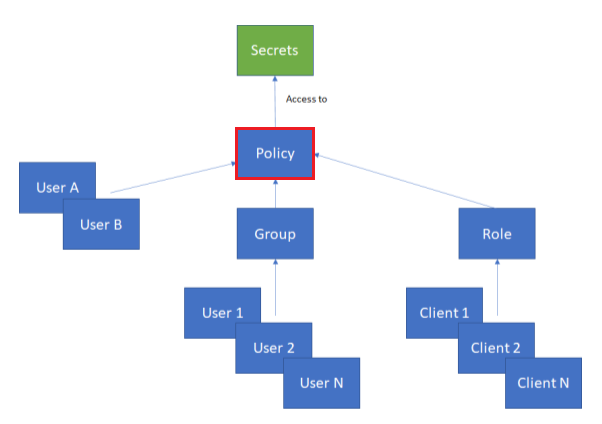

[title]: # (Create Policy)
[tags]: # (DevOps Secrets Vault,DSV,)
[priority]: # (2600)

# Provide Users Access to Secrets

* With two secrets, each located at:

    servers:us-east:server01 *and* servers:us-east:production:server01

* And two users:

    developer1@company.com *and* developer2@company.com

You can create a policy to allow:

  * both users access to servers:us-east:server01
  * developer1@company.com to **have access** to servers:us-east:production:server01
  * developer2@company.com to be **denied access** to servers:us-east:production:server01

## Create a Group

Optionally, we can put these Users in a Group with two commands. 
* The first command creates the group:

  ```bash
  dsv group create --groupname firstgroup
  ```

* The second command puts the Users in the Group

  ```bash
  dsv group add-members --group-name firstgroup --data '{"memberNames":["developer1@company.com","developer2@company.com"]}'
  ```

## Create Policy to Allow Access

The admin has to create a policy for the Group to get access to the Secrets.  Here is a sample CLI command:

  ```bash
  dsv policy create --path secrets:servers:us-east --actions '<.*>' --desc 'Allow Policy' --subjects groups:firstgroup --effect allow
  ```

* ***path*** starts with **secrets:** followed by the secret path.
    >NOTE: *resources* is not specified separately, but will default to the path and everything below it, so in this case `secrets:servers:us-east:<.*>`

* ***actions*** is a wildcard, so full `create, read, update, delete` are allowed.

* ***subjects*** are the Users that are getting access to the secrets.  

* ***effect*** will either allow or deny access. 

* Use the command **`dsv policy read secrets:servers:us-east -e yaml`** to read the resulting policy:

  ```yaml
    path: secrets:servers:us-east
    permissionDocument:
    - actions:
      - <.*>
      conditions: {}
      description: Allow Policy
      effect: allow
      id: xxxxxxxxxxxxxxxxxxxx
      meta: null
      resources:
      - secrets:servers:us-east:<.*>
      subjects:
      - groups:firstgroup
    version: "0"
    ```

* This policy will now enable both Users (developer1@company.com and developer2@company.com) to gain full access to all secrets located at the path `servers:us-east` and below.

## Create Policy to Deny Access

If we decide that the *developer2@company.com* should no longer have access to the secrets at `servers:us-east:production`, we can write another policy to deny access. The command would look like this:

```bash
dsv policy create --path secrets:servers:us-east:production --actions '<.*>' --desc 'Deny Policy' --subjects 'users:<developer2@company.com>' --effect deny
```

Use the command **`dsv policy read secrets:servers:us-east:production -e yaml`** to view the resulting policy:

```yaml
path: secrets:servers:us-east:production
permissionDocument:
- actions:
  - <.*>
  conditions: {}
  description: Deny Policy
  effect: deny
  id: xxxxxxxxxxxxxxxxxxxx
  meta: null
  resources:
  - secrets:servers:us-east:production:<.*>
  subjects:
  - users:<developer2@company.com>
version: "0"
```

Now developer1@company.com has access to everything at `servers:us-east` and below, including `servers:us-east:production`.  However, developer2@company.com only has access to the secrets at `servers:us-east` and not at `servers:us-east:production`

This is the end of the quick-start guide, but for more on policies see [CLI Reference/Policy](../../cli-ref/policy.md) in this documentation.

## Policy Tutorial

This tutorial addresses a use case in which the initial DSV admin wishes to:

* Delegate resource permissions to one admin team and three separate devops teams.
* Give each team of three users access to separate secret paths.
* Assign one person from each team rights to create roles and policies for their teammates.

### Policy Structure

Policies are the single source of all permissions in RAC. A policy contains a list of permissions that are then delegated to Groups, Roles, and/or individual Users. 

The following image demonstrates the three methods that apply policies to Users:



### Least Privilege Approach

In this tutorial, we begin as the **Initial Super Administrator** (normally your "thy-one" account). The **Initial Super Administrator** account has full, unrestricted access to all of DSV. It is best practice to follow the "Least-Privilege Administrative Model" and only use the Super Administrator account when absolutely necessary. 

To avoid using this account, we will:

1. Use the **Super Administrator** account to create new Users.
1. Create a group called "adminsgroup".
1. Assign the new Users to the "adminsgroup" group.
1. Create a policy giving the group administrative permissions.
1. Logout of the Super Administrator account.
1. Login as one of the new Users to complete the remaining administrative tasks.


### Creating Users, Groups and Permissions

First, as the Super Admin, we will create and delegate permissions to the administrators. We will create three administrators and give them permissions to manage Users, Groups, and Roles in DSV.

>**NOTE:** The following example uses placeholder usernames and passwords. Substitute these values to meet your organization's requirements.

1. Create administrators using the command and flags:

    **INPUT**:
    ```dsv user create --username adminusr1 --password Password1```

    **OUTPUT**:
    ```json
    { 
    "created": "2021-04-30T14:14:10Z",
    "createdBy": "users:thy-one:superadmin@organization.com", 
    "displayName": "",
    "externalId": "",
    "id": "dc677f9c-*******-238f6d04e137",
    "lastModified": "2021-04-30T14:14:10Z",
    "lastModifiedBy": "users:thy-one:superadmin@organization.com",
    "provider": "",
    "userName": "adminusr1",
    "version": "0"
    }
    ```
1. Repeat the command for adminusr2 and adminusr3.
  
    **INPUT**:
    ```dsv user create --username adminusr2 --password Password2```

    **OUTPUT**:
    ```json
    { 
    "created": "2021-04-30T14:14:10Z",
    "createdBy": "users:thy-one:superadmin@organization.com", 
    "displayName": "",
    "externalId": "",
    "id": "dc677f9c-*******-238f6d04e137",
    "lastModified": "2021-04-30T14:14:10Z",
    "lastModifiedBy": "users:thy-one:superadmin@organization.com",
    "provider": "",
    "userName": "adminusr2",
    "version": "0"
    }
    ```

    **INPUT**:

    ```dsv user create --username adminusr3 --password Password3```

    **OUTPUT**:
    ```json
    { 
    "created": "2021-04-30T14:14:10Z",
    "createdBy": "users:thy-one:superadmin@organization.com", 
    "displayName": "",
    "externalId": "",
    "id": "dc677f9c-*******-238f6d04e137",
    "lastModified": "2021-04-30T14:14:10Z",
    "lastModifiedBy": "users:thy-one:superadmin@organization.com",
    "provider": "",
    "userName": "adminusr3",
    "version": "0"
    }
    ```
1. Create the admins group and add the new administrators as members.

      **INPUT**:
    
      ```dsv group create --group-name adminsgroup --members adminusr1,adminusr2,adminusr```
      
      **OUTPUT**:
    
      ```json
      { 
        "addedMemberNames": ["adminusr2", "adminusr1", "adminusr3"], 
        "errors": {} 
      }
      ```
1. Give the "adminsgroup" permission to create, modify and delete Users, Groups, Roles, Policies, and Secrets on the path `secrets:servers:us-west:<.*>`. 
    >**NOTE**: Permissions *could* be assigned directly to the three Users. Assigning permissions to the **group** allows for any additional admin Users to inherit permissions in a single step.
1. Open the configuration text file using the command: `dsv config edit`.
1. Copy and paste the adminsgroup permission data outlined in the red box. Make sure it is placed after the `groups:<adminsgroup>`value and includes the preceding comma.

  ```json
  "created": "2020-04-06T12:34:57Z", 
  "createdBy": "system", 
  "lastModified": "2021-04-13T19:05:33Z", 
  "lastModifiedBy": "users:thy-one:superadmin@organization.com", 
  "permissionDocument": [
    {
      "actions": ["<.*>"], 
      "conditions": {}, 
      "description": "Default Admin Permissions", 
      "effect": "allow", 
      "id": "bq5i3******po2j2g", 
      "meta": null, 
      "resources": ["<.*>"], 
      "subjects": [
        "users:<users:thy-one:superadmin@organization.com|
        aws-auth:test-admin>", 
        "roles:<bootrole|aws-auth:aws-role|client-role|k8ext-role>", 
        "groups:<admingroup|testgroup>"
      ]
    }, 
    {
      "actions": ["<.*>"], 
      "conditions": {}, 
      "description": "Default Deny Home Permissions", 
      "effect": "deny", 
      "id": "bskn71nq4h6s72mn0sc0", 
      "meta": null, 
      "resources": ["home:<.*>"], 
      "subjects": [
        "users:<users:thy-one:superadmin@organization.com|user1|azure-auth:azuretestuser1|anotheruser1>", 
        "roles:<k8ext-role>", 
        "groups:<admingroup>"
      ]
    }
  ```

<table style="border: 2px solid red">

```json
    , 
    {
      "actions": ["<.*>"], 
      "conditions": {}, 
      "description": "Admin Permissions US-WEST", 
      "effect": "allow", 
      "meta": null, 
      "resources": ["users:<.*>","groups:<.*>","roles:<.*>","clients:<.*>","config:policies:secrets:servers:us-west:<.*>","config:policies:roles:devopsgrp1<.*>","secrets:servers:us-west:<.*>"
    ], 
      "subjects": ["groups:<adminsgroup>"]
    }

```

</table>

### Initialize the New Admin Account

Once we have created the new admin users, put them into a new admin group, and written a policy giving them permissions, we can log out of the Super Administrator account and use one of the new administrator accounts to continue with setup. Switching to an account with fewer permissions will help us adhere to the Least-Privilege Administrative Model.

1. Begin initialization with the command: `dsv init`.
1. Select `[o] overwrite the config`. This will replace the current default profile, the superadmin, with the adminusr1 account. 
1. Enter your tenant name.
1. Choose your domain.
1. Select a store type.
1. Select a cache strategy for secrets.
1. For auth type, choose `(1) Password (local user)`.
1. Once initialization is complete, confirm that you are logged int as adminusr1 with the command: `dsv whoami`.
1. The CLI should return: `users:adminusr1`

### Delegating Secret Management Rights to the DEVOPS Team1

Now that the administrators have been created and delegated permissions, we can start creating the users for the DevOps Teams. 

1. Create the three DevOps Users.
    
    **INPUT**: `dsv user create --username devopsusr1 --password Password1*`
    
    **OUTPUT**:
    ```json
    {
      "created": "2021-04-30T15:30:45Z",
      "createdBy": "users:adminusr1",
      "displayName": "",
      "externalId": "",
      "id": "44f238b5-b657-*****-4defb1d9b4cd",
      "lastModified": "2021-04-30T15:30:45Z",
      "lastModifiedBy": "users:adminusr1",
      "provider": "",
      "userName": "devopsusr1",
      "version": "0"
    }
    ```
    
    **INPUT**: `dsv user create --username devopsusr2 --password Password1*`
    
    **OUTPUT**:
    ```json
    {
      "created": "2021-04-30T15:30:45Z",
      "createdBy": "users:adminusr1",
      "displayName": "",
      "externalId": "",
      "id": "44f238b5-b657-*****-4defb1d9b4cd",
      "lastModified": "2021-04-30T15:30:45Z",
      "lastModifiedBy": "users:adminusr1",
      "provider": "",
      "userName": "devopsusr2",
      "version": "0"
    }
    ```
    
    **INPUT**: `dsv user create --username devopsusr3 --password Password1*`
    
    **OUTPUT**:
    ```json
    {
      "created": "2021-04-30T15:30:45Z",
      "createdBy": "users:adminusr1",
      "displayName": "",
      "externalId": "",
      "id": "44f238b5-b657-*****-4defb1d9b4cd",
      "lastModified": "2021-04-30T15:30:45Z",
      "lastModifiedBy": "users:adminusr1",
      "provider": "",
      "userName": "devopsusr3",
      "version": "0"
    }
    ```
1. Create the DevOps group. In the same input, we will also add the three DevOps users and the admin user to the group.
    **INPUT**: 
    ```
    dsv group create --group-name devopsgroup1 --members devopsusr1,devopsusr2,devopsusr3,adminusr1
    ```
    **OUTPUT**:
    ```json
    {
      "addedMemberNames": ["devopsusr1", "devopsusr3", "devopsusr2","adminusr1"],
      "errors": {}
    }
    ```
1. Give the new group (devopsgroup1) access to the path `servers:us-west:devopsgroup1secrets:<*>`. This gives all members of DevOps Team 1 full rights to manage secrets on the path.
    **INPUT**:
    ```
    dsv policy create --path secrets:servers:us-west:devopsgroup1secrets --subjects groups:devopsgroup1 --actions create,read,update,delete --resources "secrets:servers:us-west:devopsgroup1secrets:<.*>" --desc "Devopsgroup1 Secret Management Permissions"
    ```
    **OUTPUT**:
    ```json
    {
    "created": "2021-04-30T15:36:08Z",
    "createdBy": "users:adminusr1",
    "id": "e5c9f3de-f74b-4d1f-a984-90e31cb2e131",
    "lastModified": "2021-04-30T15:36:08Z",
    "lastModifiedBy": "users:adminusr1",
    "path": "secrets:servers:us-west:devopsgrp1secrets",
    "permissionDocument": [
      {
        "actions": ["create", "read", "update", "delete"],
        "conditions": {},
        "description": "Devopsgrp1 Secret Management Permissions",
        "effect": "allow",
        "id": "c2627q72inos72lhq18g",
        "meta": null,
        "resources": ["secrets:servers:us-west:devopsgrp1secrets:<.*>"],
        "subjects": ["groups:devopsgroup1"]
      }
    ],
    "version": "0"
    }
    ```
1. Deny devopsusr3 the rights to create, delete, and update secrets on the path `servers:us-west:devopsgroup1secrets:<*>`. Open the policy file with the command: 
    ```
    dsv policy edit --path secrets:servers:us-west:devopsgroup1secrets
    ```
1. Add the data outlined in the red box below:

  ```json
    {
  "created": "2021-04-13T13:34:43Z",
  "createdBy": "users:thy-one:ty.brannock.dsvtestingacct1@mg.thyllc.com",
  "id": "2d56bf8a-99a7-4a3e-9a30-db5596208480",
  "lastModified": "2021-04-13T13:34:43Z",
  "lastModifiedBy": "users:thy-one:ty.brannock.dsvtestingacct1@mg.thyllc.com",
  "path": "secrets:servers:us-west:devopsgrp1secrets",
  "permissionDocument": [
    {
      "actions": ["create", "read", "update", "delete"],
      "conditions": {},
      "description": "Devopsgrp1 Secret Management Permissions",
      "effect": "allow",
      "id": "c1qprsq5fkhs72p14v7g",
      "meta": null,
      "resources": ["secrets:servers:us-west:devopsgrp1secrets:<.*>"],
      "subjects": ["groups:devopsgroup1"]
    },
  ```
<table style="border: 2px solid red">

  ```json
  {
    "actions": ["create", "update", "delete"],
    "conditions": {},
    "description": "Devopsusr3 Secret Management Permissions",
    "effect": "deny",
    "meta": null,
    "resources": ["secrets:servers:us-west:devopsgrp1secrets:<.*>"],
    "subjects": ["users:devopsusr3"]
    }
     
     
    ],
  "version": "0"
  }
  ```
</table>

### Testing the DevOps Team Permission to Read Secrets

1. Create a secret on the path `secrets:servers:us-west:devopsgroup1secrets`.
    
    **INPUT**: 
      ```
      dsv secret create secrets:servers:us-west:devopsgroup1secrets:test  --data "{\"username\":\"secretuser\",\"password\":\"passwordtext123\"}"
      ```
    **OUTPUT**:
      ```json
      {
      "attributes": {},
      "created": "2021-04-30T15:40:14Z",
      "createdBy": "users:adminusr1",
      "data": {
        "password": "passwordtext123",
        "username": "secretuser"
      },
      "description": "",
      "id": "76b872be-fb5a-4849-b8c7-f8bea3b01896",
      "lastModified": "2021-04-30T15:40:14Z",
      "lastModifiedBy": "users:adminusr1",
      "path": "servers:us-west:devopsgrp1secrets:test",
      "version": "0"
      }
      ```
1. Create another secret on the path `secrets:servers:us-west:devopsgroup1secrets:test`.
    **INPUT**:
    ```
    dsv secret create secrets:servers:us-west:devopsgrp1secrets  --data "{\"username\":\"secretuser\",\"password\":\"passwordtext123\"}"
    ```
    **OUTPUT**:
    ```json
    {
    "attributes": {},
    "created": "2021-04-30T15:40:14Z",
    "createdBy": "users:adminusr1",
    "data": {
      "password": "passwordtext123",
      "username": "secretuser"
    },
    "description": "",
    "id": "76b872be-fb5a-4849-b8c7-f8bea3b01896",
    "lastModified": "2021-04-30T15:40:14Z",
    "lastModifiedBy": "users:adminusr1",
    "path": "servers:us-west:devopsgrp1secrets:test",
    "version": "0"
    }
    ```
1. Initialize with the devopsusr1 account. In order to test the permissions granted to devopsusr1 we need to initialize the account. This will create a new profile for devopsusr1 in your config file. Be sure to choose auth type “1” as this is a local user.
1. Enter the command `dsv init`.
1. Choose `[a] add a new profile to the config`.
1. Enter the profile name: `devopsusr1`.
1. Initialize `devopsusr2` and `devopsusr3` using the same sequence. Once the profiles are created, we will be able to run a single commands as devopsusr1 and devopsusr3 in the next step.
1. Read the secrets with the profile of "devopsusr1". This profile should have the permissions to read the secret under "test" while not having the permissions to read the secret under "devopsgrp1secrets".
    
    **INPUT**: 
    ```
    dsv secret read secrets:servers:us-west:devopsgrp1secrets:test --profile devopsusr1
    ```
    **OUTPUT**:
    ```json
      "attributes": {},
      "created": "2021-04-30T15:40:14Z",
      "createdBy": "users:adminusr1",
      "data": {
        "password": "passwordtext123",
        "username": "secretuser"
      },
      "description": "",
      "id": "76b872be-fb5a-4849-b8c7-f8bea3b01896",
      "lastModified": "2021-04-30T15:40:14Z",
      "lastModifiedBy": "users:adminusr1",
      "path": "us-west:devopsgrp1secrets:test",
      "version": "0"
    ```
    **INPUT**:
    ```
    dsv secret read secrets:servers:us-west:devopsgrp1secrets --profile devopsusr1
    ```
    **OUTPUT**:
    ```json
    {
      "message": "Invalid permissions"
    }
    ```
1. Attempt to create a secret with the profile of `devopsusr3`. This profile should not have the rights to create a secret on that path.
    
    **INPUT**:
    ```
    dsv secret create secrets:servers:us-west:devopsgrp1secrets:test2  --data "{\"username\":\"secretuser2\",\"password\":\"passwordtext123\"}" --profile devopsusr3
    ```
    **OUTPUT**:
    ```json
    {
      "message": "Invalid permissions"
    }
    ```

### Granting Groups the Ability to Search Entities via List Privileges

In the previous section, we verified that the members of devopsgroup1 can only manage the secrets on the path "servers:us-west:devopsgrp1secrets:<.*>" and restricted a single member of that group, devopsusr3, to only read secrets on that path. 

Now let's say the members needed to see the non-sensitive information (ex. description, path, create) of secrets on a different path. We can do this by creating permissions on the root policy to grant "list" privileges for all secrets in DSV to devopsgroup1.  List privileges can also be granted for users, groups and roles. In this example, we will only grant the permission for secrets. 

We will:
* edit the config using the command `dsv config edit --profile thyone`
* add the section outlined in red to the set of permissions that currently exist on the config policy.

```json
{
  "created": "2020-04-06T12:34:57Z", 
  "createdBy": "system", 
  "lastModified": "2021-04-30T14:34:09Z", 
  "lastModifiedBy": "users:thy-one:ty.brannock.dsvtestingacct1@mg.thyllc.com", 
  "permissionDocument": [
    {
      "actions": ["<.*>"], 
      "conditions": {}, 
      "description": "Default Admin Permissions", 
      "effect": "allow", 
      "id": "bq5i3seothfc72po2j2g", 
      "meta": null, 
      "resources": ["<.*>"], 
      "subjects": [
        "users:<thy-one:ty.brannock.dsvtestingacct1@mg.thyllc.com|thy-one:tdbrannock@outlook.com|thy-one:ty.brannock@thycotic.net|aws-auth:test-admin>", 
        "roles:<bootrole|aws-auth:aws-role|client-role|k8ext-role>", 
        "groups:<admingroup|testgroup>"
      ]
    }, 
    {
      "actions": ["<.*>"], 
      "conditions": {}, 
      "description": "Default Deny Home Permissions", 
      "effect": "deny", 
      "id": "bskn71nq4h6s72mn0sc0", 
      "meta": null, 
      "resources": ["home:<.*>"], 
      "subjects": [
        "users:<thy-one:ty.brannock.dsvtestingacct1@mg.thyllc.com|user1|azure-auth:azuretestuser1|anotheruser1>", 
        "roles:<k8ext-role>", 
        "groups:<admingroup>"
      ]
    }, 
    {
      "actions": ["<.*>"], 
      "conditions": {}, 
      "description": "Admin Permissions US-WEST", 
      "effect": "allow", 
      "id": "c261aofnu9hs72pma9t0", 
      "meta": null, 
      "resources": [
        "users:<.*>", 
        "groups:<.*>", 
        "roles:<.*>", 
        "clients:<.*>", 
        "config:policies:secrets:servers:us-west:<.*>", 
        "config:policies:roles:devopsgrp1<.*>", 
        "secrets:servers:us-west:<.*>"
      ], 
      "subjects": ["groups:<adminsgroup>"]
    }
```

<table style="border: 2px solid red">

```json
, 
    {
      "actions": ["<list>"], 
      "conditions": {}, 
      "description": "Global List Permissions - Secrets", 
      "effect": "allow", 
      "meta": null, 
      "resources": ["secrets"], 
      "subjects": ["groups:<devopsgroup1>"]
    }
```
</table>

```
  ], 
  "tenantName": "dsvtestlab", 
  "version": "2"
}
```

### Testing the DevOps Team Permissions to Search Resources

Using the profile of devopsusr1, search for the secrets located on the path "servers:us-west:devopsgrp1secrets". While the devopsusr1 profile was not able to read secrets on this path before, the list permissions allows the user to search for that secret and view its non-sensitive properties.

  **INPUT**:

  ```
  dsv secret search devopsgroup1secrets --profile devopsusr1
  ```

  **OUTPUT**:

  ```json
  {
  "cursor": "",
  "data": [
    {
      "attributes": {},
      "created": "2021-04-30T15:40:14Z",
      "createdBy": "users:adminusr1",
      "description": "",
      "id": "76b872be-fb5a-4849-b8c7-f8bea3b01896",
      "lastModified": "2021-04-30T15:40:14Z",
      "lastModifiedBy": "users:adminusr1",
      "path": "servers:us-west:devopsgrp1secrets:test",
      "version": "0"
    },
    {
      "attributes": {},
      "created": "2021-04-30T17:46:23Z",
      "createdBy": "users:adminusr1",
      "description": "",
      "id": "90c728d1-7584-49d4-86a9-89fa4ca8daa0",
      "lastModified": "2021-04-30T17:46:23Z",
      "lastModifiedBy": "users:adminusr1",
      "path": "servers:us-west:devopsgrp1secrets",
      "version": "0"
    }
  ],
  "length": 2,
  "limit": 25,
  "sort": ""
  }

```

### Delegating Rights to "Manage Policies" to a DevOps Team Member

Give "devopsusr1" the rights to create, read, update, and delete polices on the path "secrets:servers:us-west:devopsgroup1secrets_<.*>". The permissions will be applied **directly** to the user as opposed to a group. We will also give devopsgroup1 read access to any policies created by devopsusr1. Edit the policy again by adding the red-boxed json snippet below.

* Open the policy using the command:
    ```
    dsv policy edit --path secrets:servers:us-west:devopsgroup1secrets
    ```

* Add the red-boxed json data to the policy:

```json
{
  "created": "2021-04-13T13:34:43Z", 
  "createdBy": "users:thy-one:ty.brannock.dsvtestingacct1@mg.thyllc.com", 
  "id": "2d56bf8a-99a7-4a3e-9a30-db5596208480", 
  "lastModified": "2021-04-13T13:34:43Z", 
  "lastModifiedBy": "users:thy-one:ty.brannock.dsvtestingacct1@mg.thyllc.com", 
  "path": "secrets:servers:us-west:devopsgrp1secrets", 
  "permissionDocument": [
{
      "actions": ["create", "read", "update", "delete"], 
      "conditions": {}, 
      "description": "Devopsgrp1 Secret Management Permissions", 
      "effect": "allow", 
      "id": "c2627q72inos72lhq18g", 
      "meta": null, 
      "resources": ["secrets:servers:us-west:devopsgrp1secrets:<.*>"], 
      "subjects": ["groups:devopsgroup1"]
},
{
      "actions": [ "read"],
      "conditions": {},
      "description": "Devopsusr3 Secret Management Permissions",
      "effect": "deny",
      "id": "c2629jn2inos72lhq190", 
      "meta": null,
      "resources": ["secrets:servers:us-west:devopsgrp1secrets:<.*>"],
      "subjects": ["users:devopsusr3"]
    },
    {
      "actions": ["create", "read", "update", "delete"], 
      "conditions": {}, 
      "description": "Devops Team1 Policy Management Permissions", 
      "effect": "allow", 
      "meta": null, 
      "resources": ["config:policies:secrets:servers:us-west:devopsgrp1secrets:devopsgrp1policy_<.*>"], 
      "subjects": ["users:devopsusr1"]
    }
```

<table style="border: 2px solid red">

```json
,
    {
      "actions": ["read"], 
      "conditions": {}, 
      "description": "Devops Team1 Policy Read Permissions", 
      "effect": "allow", 
      "meta": null, 
      "resources": ["config:policies:secrets:servers:us-west:devopsgrp1secrets:devopsgrp1policy_<.*>"], 
      "subjects": ["groups:devopsgroup1"]
    }
```

</table>

```json
  ], 
  "version": "2"
}
```

### Test DevOpsUsr1's Permission to Create Policies

Create a policy using the profile "devopsusr1", then read the policy using the profile "devopsusr2". The first attempt to create a policy should fail because devopsusr1 is not permitted to create on the path “testfailure”. The 2nd attempt will succeed. This policy grants devopsgroup1 full privileges to manage secrets beyond the path servers:us-west:devopsgrp1secrets:devopsgrp1policy_1.

**INPUT**:

```
dsv policy create --path secrets:servers:us-west:devopsgrp1secrets:testfailure --subjects groups:devopsgroup1 --actions create,read,update,delete --profile devopsusr1
```

**OUTPUT**:
```json
{
  "message": "Invalid permissions"
}
```

**INPUT**:
```
dsv policy create --path secrets:servers:us-west:devopsgrp1secrets:devopsgrp1policy_1 --subjects groups:devopsgroup1 --actions create,read,update,delete --desc "Devopsgroup1 User-Created Policy1" --profile devopsusr1
```

**OUTPUT**:
```json
{
  "created": "2021-04-30T18:06:17Z",
  "createdBy": "users:devopsusr1",
  "id": "bc3c38d6-c7cc-49b4-817a-f98b6c409974",
  "lastModified": "2021-04-30T18:06:17Z",
  "lastModifiedBy": "users:devopsusr1",
  "path": "secrets:servers:us-west:devopsgrp1secrets:devopsgrp1policy_1",
  "permissionDocument": [
    {
      "actions": ["create", "read", "update", "delete"],
      "conditions": {},
      "description": "Devopsgroup1 User-Created Policy1",
      "effect": "allow",
      "id": "c264e69ehf7c72g0ddg0",
      "meta": null,
      "resources": [
        "secrets:servers:us-west:devopsgrp1secrets:devopsgrp1policy_1:<.*>"
      ],
      "subjects": ["groups:devopsgroup1"]
    }
  ],
  "version": "0"
}
```

### Delegate Rights to "Create Roles" to a DevOps Team Member

Give "devopsusr1" the rights to create, read, and assign roles by the name "devopsgrp1-roles<.*>". This user will be the only member of the group that can create roles. Note that the resource must be named appropriately otherwise the attempt to create will fail. This step will make it easier to audit the creation of policies and provide user accountability. 
 
**INPUT**: 
```
dsv policy create --path roles:devopsgrp1_role --subjects users:devopsusr1 --desc "Devopsgrp1 Role Assignment Permissions" --resources "roles:devopsgrp1_role<.*>" --actions create,assign,read
```

**OUTPUT**:

```json
{
  "created": "2021-04-30T18:09:42Z",
  "createdBy": "users:adminusr1",
  "id": "9f46574a-41cd-4d1b-a03b-d91740aa0321",
  "lastModified": "2021-04-30T18:09:42Z",
  "lastModifiedBy": "users:adminusr1",
  "path": "roles:devopsgrp1_role",
  "permissionDocument": [
    {
      "actions": ["create", "assign", "read"],
      "conditions": {},
      "description": "Devopsgrp1 Role Assignment Permissions",
      "effect": "allow",
      "id": "c264fphehf7c72g0ddgg",
      "meta": null,
      "resources": ["roles:devopsgrp1_role<.*>"],
      "subjects": ["users:devopsusr1"]
    }
  ],
  "version": "0"
}
```

We will also give "devopsgroup1" read permissions for any role created by "devopsusr1". 

* Open the policy using the command: `dsv policy edit --path roles:devopsgrp1_role` 

* Edit the policy we have just created by adding the red-boxed json snippet below:

```json
{
  "created": "2021-04-22T15:18:02Z",
  "createdBy": "users:adminusr1",
  "id": "5c8b225f-89d6-4f4e-9c67-03b333a9ff4d",
  "lastModified": "2021-04-22T15:18:02Z",
  "lastModifiedBy": "users:adminusr1",
  "path": "roles:devopsgrp1_role",
  "permissionDocument": [
    {
      "actions": ["create", "assign", "read"],
      "conditions": {},
      "description": "Devopsgrp1 Role Assignment Permissions",
      "effect": "allow",
      "id": "c20p7alfo4sc72ggua4g",
      "meta": null,
      "resources": ["roles:devopsgrp1_role<.*>"],
      "subjects": ["users:devopsusr1"]
    }
```
<table style="border: 2px solid red">

```json
    ,
{
      "actions": ["read"],
      "conditions": {},
      "description": "Devopsgrp1 Role Read Permissions",
      "effect": "allow",
      "meta": null,
      "resources": ["roles:devopsgrp1_role<.*>"],
      "subjects": ["groups:devopsgroup1"]
    }
 
```
</table>

```json
  ],
  "version": "0"
}
```

* Test devopsusr1's permission to create roles.
    1. Attempt to create a role using a name outside of what devopsusr1 has the permissions to create:

        **INPUT**:
        ```
        dsv role create --name devopsgrp1-roletestfailure --profile devopsusr1
        ```
        **OUTPUT**:
        ```
        { 
        "message": "Invalid permissions" 
        } 
        ```
    1. Now perform a test within the user's permissions:

        **INPUT**:
        ```
        dsv role create --name devopsgrp1_role1 --profile devopsusr1
        ```
        **OUTPUT**:
        ```json
        { "created": "2021-04-30T18:18:03Z", 
        "createdBy": "users:devopsusr1", 
        "description": "", 
        "externalId": "", 
        "groups": null, 
        "id": "73b0073c-b695-43fe-885c-932c8b9a5d8f", 
        "lastModified": "2021-04-30T18:18:03Z", 
        "lastModifiedBy": "users:devopsusr1", 
        "name": "devopsgrp1_role1", 
        "provider": "", 
        "version": "0" }
        ```

### Create DevOpsTeam1's Client Credentials for an Application

Using the role that we just created with the dev "devopsgrp1-role1", we will create client credentials. The credentials will be associated with the role and inherit the permissions that the role has been delegated

1. Add the role to the "devopsgrp1policy_1" Policy. We will use the "update" flag to add the role as an additional subject of the policy.
    **INPUT**:
    ```
    dsv policy update --path secrets:servers:us-west:devopsgrp1secrets:devopsgrp1policy_1 --subjects groups:devopsgroup1,roles:devopsgrp1_role1 --actions create,read,update,delete --desc "Devopsgrp1 User-Created Polciy1"
    ```
    **OUTPUT**:
    ```json
    { 
    "created": "2021-04-30T18:06:17Z", 
    "createdBy": "users:devopsusr1", 
    "id": "bc3c38d6-c7cc-49b4-817a-f98b6c409974", 
    "lastModified": "2021-04-30T18:20:24Z", 
    "lastModifiedBy": "users:devopsusr1", "path": "secrets:servers:us-west:devopsgrp1secrets:devopsgrp1policy_1", "permissionDocument": [ 
    { 
        "actions": ["create", "read", "update", "delete"], 
        "conditions": {}, 
        "description": "Devopsgrp1 User-Created Polciy1", 
        "effect": "allow", 
        "id": "c264kq1ehf7c72g0ddhg", 
        "meta": null, 
        "resources": [ "secrets:servers:us-west:devopsgrp1secrets:devopsgrp1policy_1:<.*>" 
      ], "subjects": ["groups:devopsgroup1", "roles:devopsgrp1_role1"] 
    } 
    ], 
    "version": "1" 
    }
    ```
1. Create the devops team1 Client. A Client ID and Client Secret will be provided for the next step.
    **INPUT**:
    ```
    dsv client create --role devopsgrp1_role
    ```
    **OUTPUT**:
    ```json
    { 
    "clientId": "33c2b014-27af-49fa-b4b3-44e8c1cad2b9", 
    "clientSecret": "1E_uAzxTWbwMjJcfEIP1294pAhp-pkOX5ECqDNZOk8s", 
    "created": "2021-04-30T18:21:38Z", 
    "createdBy": "users:adminusr1", 
    "id": "f131e1fb-bc04-4015-ac8b-0e7ba5c2e20f", 
    "role": "devopsgrp1_role1", 
    "url": false }
    ```

### Testing the "Read Secret" Permissions of the DevOpsTeam1's Client Credential

1. Initialize with the client using `dsv init`. 
1. Select [a] add a new profile to the config) and name your profile name "clienttest". 
1. Choose “(2) Client Credential” for the Auth Type. 
1. When prompted, provide the Client ID and Client Secret below:
    ```yaml
    Found an existing cli-config located at 'C:\Users\tbrannock\.thy.yml' 
    Select an option: 
        [o] overwrite the config 
        [a] add a new profile to the config 
        [n] do nothing (default:n) a 
    Please enter profile name: clienttest 
    Please enter tenant name: dsvtestlab 
    Please choose domain: 
        (1) secretsvaultcloud.com (default) 
        (2) secretsvaultcloud.eu 
        (3) secretsvaultcloud.com.au 
        (4) secretsvaultcloud.ca 
    Selection: 
    Please enter store type: 
        (1) File store (default) 
        (2) None (no caching) 
        (3) Pass (Linux only) 
        (4) Windows Credential Manager (Windows only) 
    Selection: Please enter directory for file store (default:C:\Users\tbrannock\.thy): Please enter cache strategy for secrets: 
        (1) Never (default) 
        (2) Server then cache 
        (3) Cache then server 
        (4) Cache then server, but allow expired cache if server unreachable 
    Selection: 
    Please enter auth type: 
        (1) Password (local user) (default) 
        (2) Client Credential 
        (3) Thycotic One (federated) 
        (4) AWS IAM (federated) 
        (5) Azure (federated) 
        (6) GCP (federated) 
        (7) OIDC (federated) 
    Selection: 2 
    Please enter client id for client auth: 33c2b014-27af-49fa-b4b3-44e8c1cad2b9 Please enter client secret for client auth: *******************************************
    ```
1. Create a secret on the path: secrets:servers:us-west:devopsgrp1secrets:devopsgrp1polcicy_1:test
    **INPUT**:
    ```
    dsv secret create secrets:servers:us-west:devopsgrp1secrets:devopsgrp1policy_1:test --data "{\"username\":\"secretuser\",\"password\":\"passwordtext123\"
    ```
    **OUTPUT**:
    ```json
    { 
    "attributes": {}, 
    "created": "2021-04-30T18:27:49Z", 
    "createdBy": "users:adminusr1", 
    "data": { 
    "password": "passwordtext123", 
    "username": "secretuser" 
    }, 
    "description": "", 
    "id": "04e203f9-b275-4140-bce5-218b80815c23", 
    "lastModified": "2021-04-30T18:27:49Z", 
    "lastModifiedBy": "users:adminusr1", 
    "path": "servers:us-west:devopsgrp1secrets:devopsgrp1policy_1:test", 
    "version": "0" 
    }
    ```
1. Read the secret with the profile of the Client Credentials "Clienttest"
    ```
    dsv secret read secrets:servers:us-west:devopsgrp1secrets:devopsgrp1policy_1:test --profile Clienttest
    ```
1. Repeat the procedure for Team 2 and Team 3.